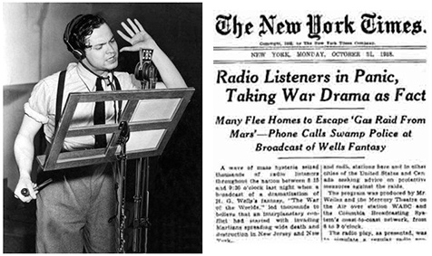
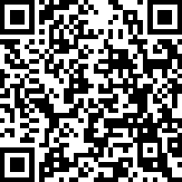
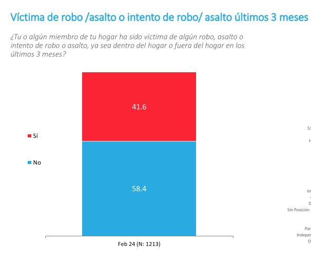
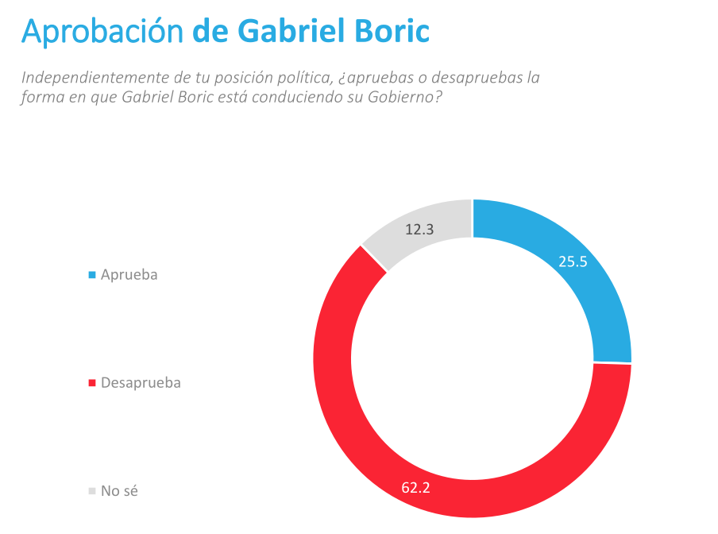
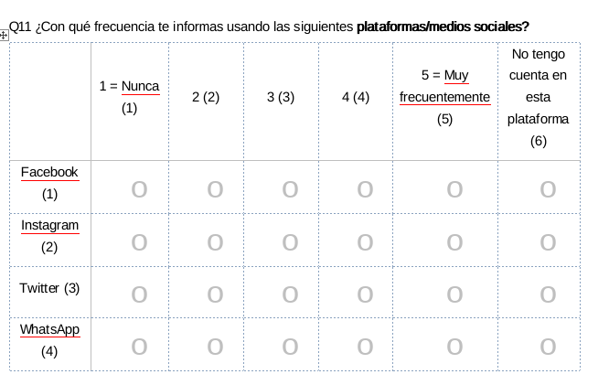
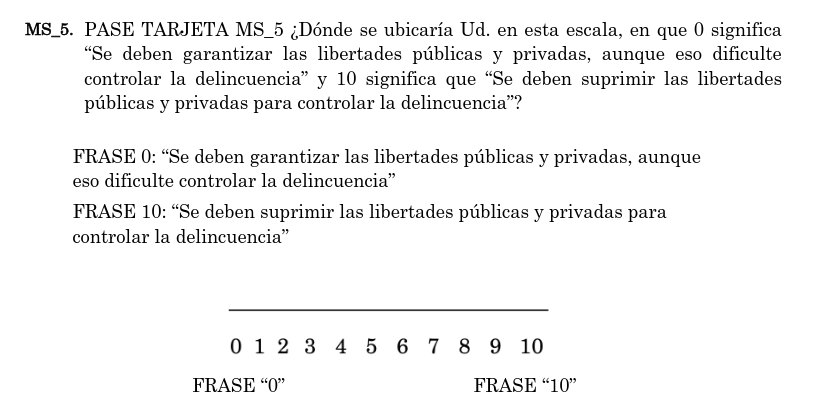
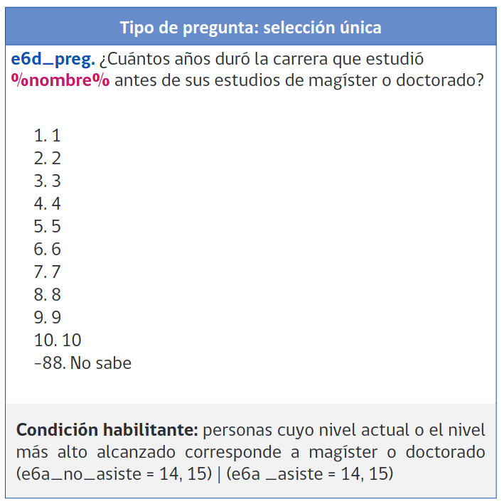
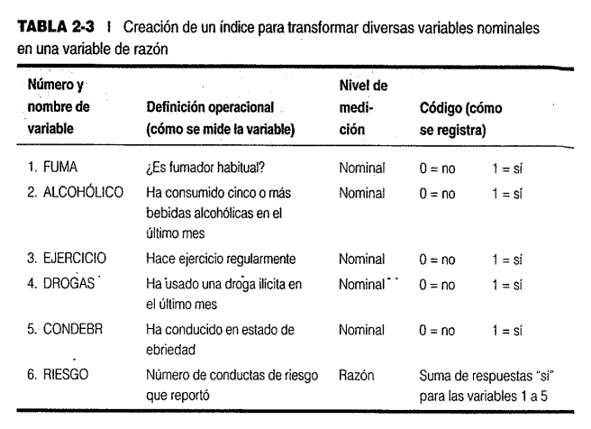

class:center, middle, bg_karl

```{r setup, include=FALSE}
options(htmltools.dir.version = FALSE)
knitr::opts_chunk$set(
  fig.width=9, fig.height=3.5, fig.retina=3,
  out.width = "100%",
  cache = FALSE,
  echo = FALSE,
  message = FALSE, 
  warning = FALSE,
  hiline = TRUE
)
```


```{r xaringan-themer, include=FALSE, warning=FALSE}
library(knitr)
library(xaringanthemer)
style_duo_accent(
  primary_color = "#b01333",
  secondary_color = "#085e9f",
  inverse_header_color = "#FFFFFF"
)
```
```{css, echo=F}
h1, h2, h3 {
  text-align: center;
}
```


```{css, echo = F}

.reduced_opacity {
  opacity: 0.1;
}


.bg_karl {
  position: relative;
  z-index: 1;
}
.bg_karl::before {    
      content: "";
      background-image: url('https://www.oii.ox.ac.uk/wp-content/uploads/2021/11/Public-opinion-image-700x385-1.png');
      background-size: cover;
      position: absolute;
      top: 0px;
      right: 0px;
      bottom: 0px;
      left: 0px;
      opacity: 0.35;
      z-index: -1;
}
```

## Estadística y Opinión Pública

### Clase 1: Introducción


<br>

#### Francisco Villarroel Riquelme (CICS- UDD) 
#### 


<br>
<br>
<br>
<br>
<br>
```{r, echo=FALSE, message = FALSE, out.width="30%", fig.align='center'}
knitr::include_graphics("clase1_files/Comunicaciones_udd.png")
```

---
background-image: url(clase1_files/Comunicaciones_udd.png)
background-size: 150px
background-position: 97% 97%

# ¿Qué veremos hoy?

- Normas y reglas del profesor
- Exposición del programa del curso
- Introducción a la teoría de la opinión pública

---
background-image: url(clase1_files/Comunicaciones_udd.png)
background-size: 150px
background-position: 97% 97%
class: left, middle


## ¿Quién es el profesor?

- Licenciado en Historia, U de Chile (2017)
- Magíster en Ciencias Sociales, mención estudios de la sociedad Civil (2022)
- Candidato a Doctor en Ciencias de la Complejidad Social, CICS-UDD
 
--
 
**Interés:** Ciencias Sociales experimentales, Influencia social, normas sociales 
 
--
 
**Trabajos actuales**: Líderes y comportamiento antisocial, Cámaras de eco e intolerencia política


---
background-image: url(clase1_files/Comunicaciones_udd.png)
background-size: 150px
background-position: 97% 97%
class: left, middle


### Normas del curso


- **Puntualidad:** Los estudiantes tienen posibilidad de entrar 15min después de iniciada la sesión

--

- **¿Qué pasa después?**: Entre al bloque siguiente.

--

- **La diapo no es todo:** No escriban lo que está en la diapo, escriban reflexciones y datos que se en clases.

--

- **Diálogo y debate:** Se invita a los estudiantes a participar. ¡Hay puntos por ello!

--

- **Chat GPT:** Cada trabajo que he propuesto he iterado 100 veces en chat GPT. No insista en ello

-- 

- **Creatividad y pensamiento crítico:** A la universidad se viene a pensar y a crear

--

- **La Asistencia mínima del curso es 80%**

--

- **Perdón, me cuesta aprender nombres**

--

- Si tiene alguna complicación, favor mandar correo: [fvillarroelr@udd.cl](mailto:fvillarroelr@udd.cl)


---
class: inverse, center, middle


## Estructura del curso


---
background-image: url(clase1_files/Comunicaciones_udd.png)
background-size: 150px
background-position: 97% 97%
class: left, middle


## Objetivo


>_"Fortalecer en los estudiantes la capacidad de analizar, interpretar y comunicar información cuantitativa relevante para el ejercicio profesional del periodismo y la comunicación en distintos contextos organizacionales."_

---
background-image: url(clase1_files/Comunicaciones_udd.png)
background-size: 150px
background-position: 97% 97%
class: left, middle


## Unidades:

- **Alfabetización estadística para periodistas y comunicadores.**

> Elementos básicos de estadística descriptiva, visualización de datos, muestreo y error estadístico

--

- **Excel para periodistas y comunicadores.**

> Procesos básicos de estadística descriptiva con Excel

--

- **Escritura y comunicación con cifras**

> Escritura de noticias en base a datos

--

- **Medios, opinión pública y uso profesional de datos**

> Lectura e interpretación de datos.

--

- **Fuentes abiertas y bases de datos para periodismo y comunicación**

> Entender la industria de las encuestas de opinión y dónde buscar información

--

- **Del dato al relato**


---
background-image: url(clase1_files/Comunicaciones_udd.png)
background-size: 150px
background-position: 97% 97%
class: left, middle


## Evaluaciones

- **Tareas y participación en clases: 10%**

> El pensamiento crítico se desarolla dialógica y grupalmente.

--

- **Controles: 10%**

> Tareas breves acumulativas para desarrollar habilidadeds estadísticas y de interpetación

--

- **Certamen 1: 25%**

> Análisis estadístico de desde un informe, y el análisis estadístico desde una base de datos. Trabajo grupal (max. 4)

--

- **Certamen 2: 25%**

> Chequeo de conocimientos en visualización e interpretación de datos + creación de producto periodistico

--

- **Examen: 30%**

> Examen oral y grupal en base a set de preguntas enviadas por el profesor. 


---
class: inverse center middle


## ¿Qué es la opinión pública?


---
background-image: url(clase1_files/Comunicaciones_udd.png)
background-size: 150px
background-position: 97% 97%
class: left, middle

## Modelo clásico de opinión pública


Provisionalmente, la opinión pública son:

> "Juicios colectivos fuera de la esfera del gobierno que afecten la toma de decisiones políticas"

---
background-image: url(clase1_files/Comunicaciones_udd.png)
background-size: 150px
background-position: 2% 97%
class: left, middle

## Opinión como logos 


.pull-left[


```{r, fig.cap="Inmanuel Kant, Filósofo (1724 - 1804)", out.width="40%"}
knitr::include_graphics("https://upload.wikimedia.org/wikipedia/commons/7/79/Immanuel_Kant_-_Gemaelde_1.jpg")
```


]


.pull-right[

>__"Pero ¿qué limitación es obstáculo a la ilustración? 
Contesto: el uso público de su razón debe estar permitido a todo el
mundo y esto es lo único que puede traer ilustración a los hombres; su uso
privado se podrá limitar a menudo ceñidamente, sin que por ello se retrase
en gran medida la marcha de la ilustración. Entiendo por uso público aquel
que, en calidad de maestro, se puede hacer de la propia razón ante el gran
público del mundo de lectores."__ (Inmanuel kant, ¿Qué es la ilustración?)

]

---
background-image: url(clase1_files/Comunicaciones_udd.png)
background-size: 150px
background-position: 97% 97%
class: inverse, center, middle


## Modelo opinión pública, espacio público, sociedad civil y grupos de interés


---
background-image: url(clase1_files/Comunicaciones_udd.png)
background-size: 150px
background-position: 97% 97%
class: inverse, center, middle


## Sospechas al concepto de Opinión Pública


---
background-image: url(clase1_files/Comunicaciones_udd.png)
background-size: 150px
background-position: 97% 97%


### Sospechas - ¿La opinión pública cambia algo?

.pull-left[

```{r, fig.align='center', out.width="70%"}
knitr::include_graphics("https://media.licdn.com/dms/image/D4D12AQGDUr5y3SNkJg/article-cover_image-shrink_720_1280/0/1694882155632?e=2147483647&v=beta&t=ccsdKv1CkDjJ7oOh2NMmkkaATUkTgKwRilNv4R22mRE")
```


]

.pull-right[

- La teoría de la democracia exige mucho a los ciudadanos
- Sobre todo en la actualidad, "tener opinión" es costoso en tiempo y recursos cognitivos
- A las personas tampoco parece importarles tanto
- Visión de los medios como educadores de la opinión pública es ingenua o al menos, poco factible

]

---
background-image: url(clase1_files/Comunicaciones_udd.png)
background-size: 150px
background-position: 97% 97%
class: left, middle

### Sospechas - Falta de métodos


- El problema no es el ciudadano, es la falta de comunicación efectiva
- Desarrollo de habilidades de discernimiento vía educación
- "Mejora de los métodos y condiciones de debate, discusión y persuación" (Dewey, 1927)


---
background-image: url(clase1_files/Comunicaciones_udd.png)
background-size: 150px
background-position: 97% 97%

### Sospechas - La tiranía de la Opinión Pública

.pull-left[


```{r, fig.align='center', out.width="90%"}
knitr::include_graphics("https://miro.medium.com/v2/resize:fit:720/format:webp/1*MPwRsltJ-W6wAm6ivVSVtg.jpeg")
```


]

.pull-right[

- La opinión puede volverse "la tiranía de una mayoría que piensa de cierta forma"
- _Teoría de la espiral del silencio_ (Noelle-Neumann)
- La opinión pública puede quedar en niveles muy básicos de desarrollo
- Presiones sociales para pensar de cierta forma

]

---
background-image: url(clase1_files/Comunicaciones_udd.png)
background-size: 150px
background-position: 3% 97%
class: left, middle

### Sospechas - Rol de la persuación


.pull-left[

- **Axioma principal:** la opinión pública es más emocional que racional
- La convergencia de opiniones no es un misterio: es una ciencia bien estudiada y practicada
- Rol de propaganda desde H.G Wells hasta la alemania nazi


]

.pull.right[

```{r, fig.align='center', out.width="50%"}



```


]

---
background-image: url(clase1_files/Comunicaciones_udd.png)
background-size: 150px
background-position: 97% 97%


### Sospechas - Dominio de las élites


.pull-left[

```{r, echo=FALSE, out.width="70%", fig.align='center'}
knitr::include_graphics("https://media.urgente24.com/p/8d91ac2ce49f665598e1b8329f302ed8/adjuntos/319/imagenes/002/000/0002000570/dfsjpg.jpg")
```

]

.pull-right[

- Democracias no tienen una estructura de ciudadanos activos
- Esto lleva a que élites organizadas manejen la información
- Opinión pública puede ser maleable por ellas
- No hay debate democrático, sino más bien un _mercado de consumo de información_


]

---
background-image: url(clase1_files/Comunicaciones_udd.png)
background-size: 150px
background-position: 97% 97%
class: left, middle

### Síntesis

- Opinión pública como juicios colectivos que influyen en la política tienen diversas aristas
- Sospechas al concepto de opinión pública ponen a prueba si es realmente dedmocrático

---
class: inverse, center, middle


## Hagamos un ejercicio:


```{r, out.width="35%"}

```


---
background-image: url(clase1_files/Comunicaciones_udd.png)
background-size: 150px
background-position: 97% 97%
class: inverse, center, middle


# Métodos cuantitativos y opinión pública


---
background-image: url(clase1_files/Comunicaciones_udd.png)
background-size: 150px
background-position: 97% 97%
class: left, middle


## Elementos básicos de los métodos cuantitativos:

.left-column[

#### 1. Asignación de números
#### 2. Producción de información 
#### 3. Procedimientos para procesar datos
#### 4. Rol de la teoría
#### 5. Selección de individuos
]

.right-column[

1. M. Cuantitativos miden aspectos de la realidad social por medio de números
2. La encuesta es el instrumento básico, pero no el único
3. Estadística es la herramienta esencial para manipular, procesar y calcular sobre grandes bases de datos
4. A partir de la **operacionalización** hacemos que teorías sean medibles, y nos permiten interpretar información
5. Métodos Cuantitativos permiten inferir cosas sobre más personas. Para eso se necesitan _técnicas de muestreo_

]

---
background-image: url(clase1_files/Comunicaciones_udd.png)
background-size: 150px
background-position: 97% 97%
class: left, top


# Principio de medición

--

- Su premisa básica es que podemos asignar números a ciertas **propiedades que poseen las personas**. 

--

- Medir implica que:

--

1. Existe simplicidad (las ideas expresadas son unívocas)

2. Hay orden, que implica que hay números "superiores" e "inferiores" (así comos signos diferentes)

3. Podemos observar distancias entre distintas magnitudes


---
background-image: url(clase1_files/Comunicaciones_udd.png)
background-size: 150px
background-position: 97% 97%
class: left, middle

## ¿Qué se mide en la opinión pública?


.pull-left[

>_"Las encuestas de opinión pública son estudios sistemáticos y estructurados que utilizan cuestionarios y entrevistas para recopilar información de una muestra representativa de la población de interés"_

Enfoque en _variables latentes_: actitudes y/o creencias no observables directamente.

]

--

.pull-right[

### Aplicado para: 

1. Medir preferencias intención de voto y aprobación a figuras políticas.
2. Recolectar información sobre actitudes sobre ciertas políticas.
3. Medir tendencias en la población.
4. Evaluar y monitoear desempeño de políticas públicas.
5. Identificar necesidades y prioridades de la opinión pública.
6. Examinar movimiento de valores sociales y expectativas de las personas.

]

---
background-image: url(clase1_files/Comunicaciones_udd.png)
background-size: 150px
background-position: 97% 97%
class: left, middle

## Encuesta y métodos cuantitativos

1. La encuesta es la herramienta más usada, **pero no es la única**

Otros ejemplos:

2. Datos administrativos (censales, datos obtenmidos por ley de transparencia, datos de superintendencias, etc)
3. Datos de redes sociales (métricas, comentarios en redes sociales, redes de contactos e interacción, etc)
4. Datos experimentales (mucho + que una encuesta)


---
background-image: url(clase1_files/Comunicaciones_udd.png)
background-size: 150px
background-position: 97% 97%
class: left,  middle

## Beneficios de las encuestas de opinión pública

.left-column[

### 1.Representatividad
### 2.Comparabilidad
### 3.Versatilidad
### 4.Eficiencia


]


.right-column[

- 1.1 **Si el muestreo es bueno**, permite hacer estimaciones precisas de lo que cree la población.
- 2.1 Permite comparar lo que piensan diferentes grupos, y las mismas personas a través del tiempo.
- 3.1 Se pueden cubrir una infinidad de temas.
- 4.1 Recopilan mucha información para una gran cantidad de población en poco tiempo.

]


---
background-image: url(clase1_files/Comunicaciones_udd.png)
background-size: 150px
background-position: 97% 97%
class: left, middle

## Obstáculos y desafíos de las encuestas de opinión pública

.left-column[

#### 1.Sesgo de medición
#### 2.No respuesta de encuestas
#### 3.Limitaciones de profundiad y complejidad
#### 4.Cambios temporales y de contexto


]


.right-column[

- 1.1 Las encuestas están sometidas a **sesgos de respuesta**, **Sesgos de formulación** y **Sesgos de recuerdo**, Afectando validez.
- 2.1 Que no respondan las encuestas genera sesgos de selección y muestras sesgadas.
- 3.1 Encuestas habitualmente son cortas, por lo que no alcanzan gran profundidad.
- 4.1 Hay contextos no controlados que hacen que las respuestas cambien.

]

---


class: inverse,center, middle

## Tipos de variables

---

```{r, out.width="68%", fig.align='center'}
knitr::include_graphics("https://analisisdecircuitos1.wordpress.com/wp-content/uploads/2023/07/image-1.png")
```


---
background-image: url(clase1_files/Comunicaciones_udd.png)
background-size: 150px
background-position: 97% 97%
class: left, top


## Tipos de variables: categóricas o nominales

.pull-left[

- Se caracterizan por ser distintas categorías, clases o tipo de información **sin jerarquía**
- No admiten puntuaciones numéricas ordenadas
- Existen en su versión dicotómica (si-no) o categorías múltiples
- A veces se codifican con números en las bases de datos, pero eso no significa nada.

]

.pull-right[

```{r, out.width="80%", fig.align='center'}

```

]


---

```{r, out.width="75%", fig.align='center'}

```

---
background-image: url(clase1_files/Comunicaciones_udd.png)
background-size: 150px
background-position: 97% 97%
class:left, top

## Tipos de variables: ordinales


.pull-left[


```{r, out.width="100%"}

```

]


.pull-right[

- Son categorías, pero tienen una propiedad de orden interno y jerarquización clara.
- A pesar de que haya jerarquía, la diferencia de numéricas porque no hay forma específica de definir la distancia entre categorías
- ej: cuánta diferencia real hay entre "de acuerdo" y "muy de acuerdo"?
- Versiones clásicas: escalas likert, escalas de polaridad


]

---
background-image: url(clase1_files/Comunicaciones_udd.png)
background-size: 150px
background-position: 97% 97%
class:left, top

```{r, out.width="80%", fig.align='center'}


```

---
background-image: url(clase1_files/Comunicaciones_udd.png)
background-size: 150px
background-position: 97% 97%
class:left, top

## Tipos de variables: Numéricas (contínuas) o de razón

 
.pull-left[

```{r, out.width="110%"}
knitr::include_graphics("https://www.researchgate.net/profile/Claudio-Agostini-2/publication/228416139/figure/fig2/AS:340663708209157@1458231965513/Figura-4-Distribucion-del-Ingreso-y-Gasto-en-Chile-2006-2007.png")
```

]

.pull-right[

- Variable numérica que incluye decimales,y puede tomar números $-\infty$ a + $+\infty$ 
- También puede ser considerado una variable de razón una versión contína entre 0 y 1
- Estas variables habitualmente son sintéticas (ej: centralidad de red)
- Es la variable que más versatilidad, precisión y eficiencia tiene al momento de hacer cálculos estadísticos


]


---
background-image: url(clase1_files/Comunicaciones_udd.png)
background-size: 150px
background-position: 97% 97%
class:left, top

## Tipos de variables: Numéricas (discretas)

.pull-left[

- Variables que sólo contemplan números enteros
- Pueden ser a partir de conteos
- Tiene propiedades muy similares a las variables de razón en lo que respecta a cálculos estadísticos
- Ej: Puntaje PAES


]

.pull-right[


```{r, out.width="90%", fig.align='center'}

```


]

---
background-image: url(clase1_files/Comunicaciones_udd.png)
background-size: 150px
background-position: 97% 97%
class:center, middle


```{r, out.width="60%", fig.align='center'}

```


---
background-image: url(clase1_files/Comunicaciones_udd.png)
background-size: 150px
background-position: 97% 97%
class:left, top

## Ejemplos de variables:

- fechas (día-mes-año)

--

- Signo zodiacal

--

- índice de capital social (0 a 1)

--

- Rating

--

- Número de visitas a un artículo periodístico

--

- Hashtags

--

- Cantidad de hijos en un hogar

---
class: inversed, center, middle
background-image: url(https://user-images.githubusercontent.com/163582/45438104-ea200600-b67b-11e8-80fa-d9f2a99a03b0.png)
background-size: 80px
background-position: 50% 90%

# ¡Gracias!


###fvillarroelr@udd.cl

Slide creado con el paquete [**xaringan**](https://github.com/yihui/xaringan).


El  chakra viene de [remark.js](https://remarkjs.com), [**knitr**](https://yihui.org/knitr/), y [R Markdown](https://rmarkdown.rstudio.com).
Este slide fue creado por [**xaringan**](https://github.com/yihui/xaringan) y [**XaringanThemer**](https://pkg.garrickadenbuie.com/xaringanthemer/index.html)