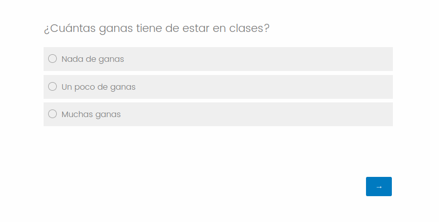
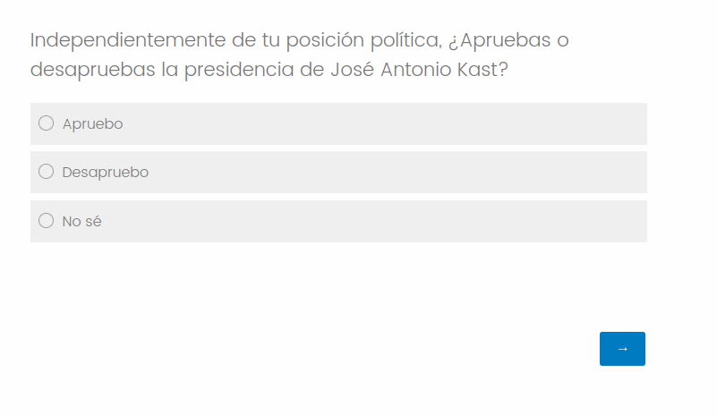
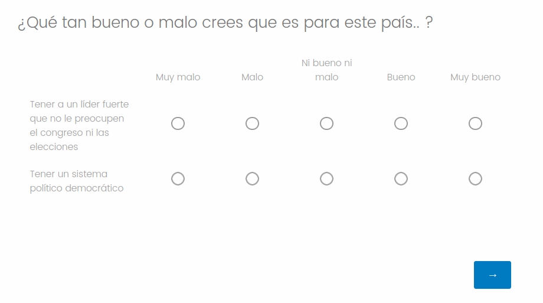
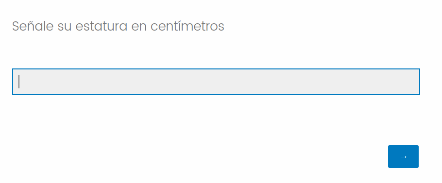
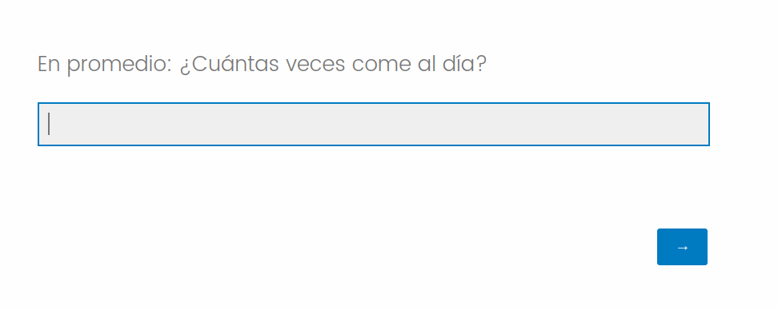
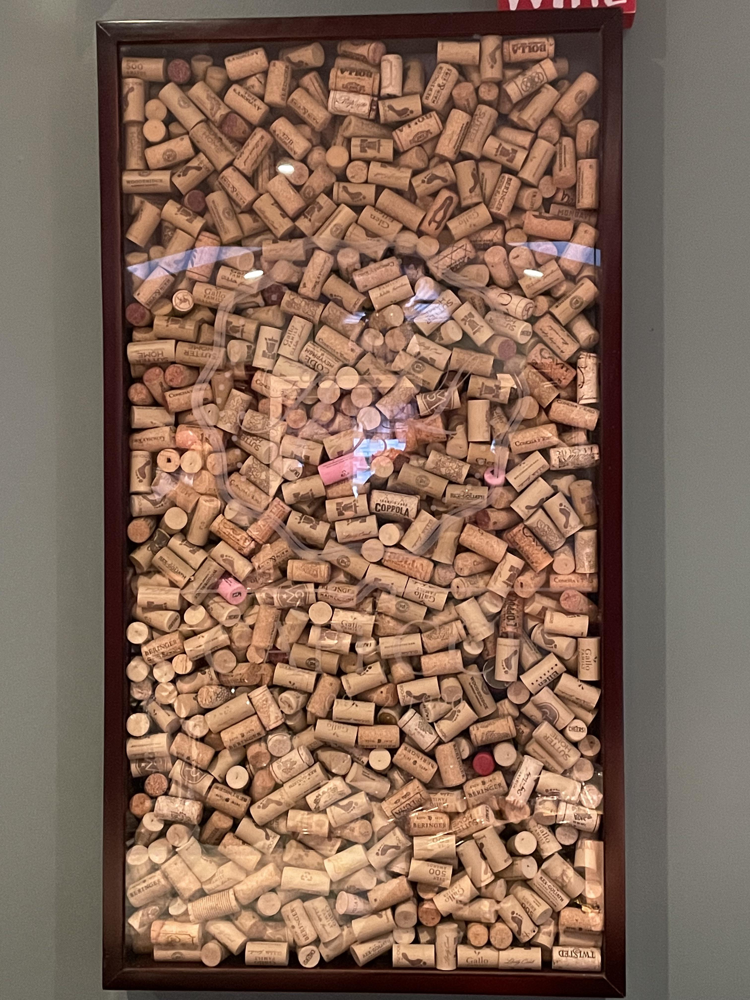
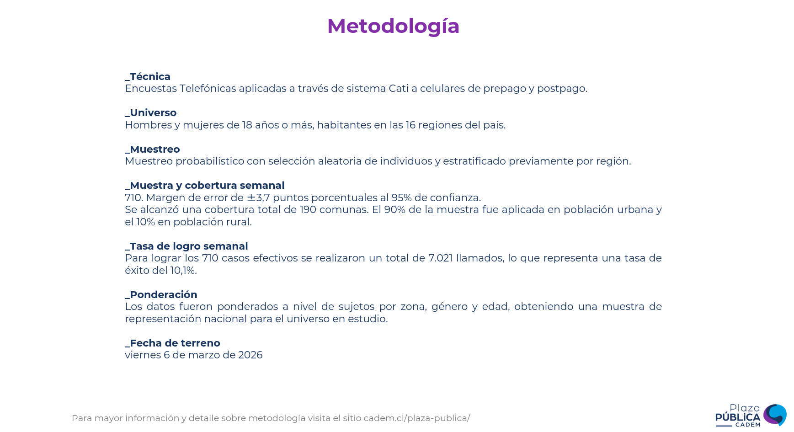

class:center, middle, bg_karl

```{r setup, include=FALSE}
options(htmltools.dir.version = FALSE)
knitr::opts_chunk$set(
  fig.width=9, fig.height=3.5, fig.retina=3,
  out.width = "100%",
  cache = FALSE,
  echo = FALSE,
  message = FALSE, 
  warning = FALSE,
  hiline = TRUE
)
```


```{r xaringan-themer, include=FALSE, warning=FALSE}
library(knitr)
library(xaringanthemer)
style_duo_accent(
  primary_color = "#b01333",
  secondary_color = "#085e9f",
  inverse_header_color = "#FFFFFF"
)
```
```{css, echo=F}
h1, h2, h3 {
  text-align: center;
}
```


```{css, echo = F}

.reduced_opacity {
  opacity: 0.05;
}


.bg_karl {
  position: relative;
  z-index: 1;
}
.bg_karl::before {    
      content: "";
      background-image: url('https://www.pewresearch.org/wp-content/uploads/2022/10/3-header_howPollingWorks.jpg');
      background-size: cover;
      position: absolute;
      top: 0px;
      right: 0px;
      bottom: 0px;
      left: 0px;
      opacity: 0.1;
      z-index: -1;
}
```

## Análisis estadístico y opinión Pública
### Clase 2: Introducción a los métodos cuantitativos en Opinión Pública
#### Medir, clasificar, muestrear

<br>

#### Francisco Villarroel Riquelme (CICS- UDD) 
#### 


<br>
<br>
<br>
<br>
```{r, echo=FALSE, message = FALSE, out.width="30%", fig.align='center'}
knitr::include_graphics("clase2_files/Comunicaciones_udd.png")
```

---
background-image: url(clase2_files/Comunicaciones_udd.png)
background-size: 150px
background-position: 97% 97%
class: left, top


# ¿Qué veremos hoy?

- Haremos una breve introducción a los métodos cuantitativos
- Comprenderemos la teorìa y diferencias de las distintas variables para medir
- Revisaremos teoría del muestreo y cómo estimar muestras para distintos casos


---
background-image: url(clase2_files/Comunicaciones_udd.png)
background-size: 150px
background-position: 97% 97%
class: left, top

## Un pequeño repaso

<br>

- Los métodos cuantitativos tienen como principio la medición de la realidad social
- Se usa para medir atributos de las personas y analizarlos a través del tiempo
- El proceso teórico principal es el de la _operacionalización_ (volver medibles teorías)
- La encuesta y la estadística son el mecanismo de recolección y de análisis más común


---
background-image: url(clase2_files/Comunicaciones_udd.png)
background-size: 150px
background-position: 97% 97%
class: left, top


# Repaso: Medición

--

- Cuando medimos, se obtienen variables agrupadas en dos grandes grupos: Cualitativas y cuantitativas
- Las variables cualitativas denonan _cualidades_ de las personas y sus atributos
- Las variables cuantitativas se centran en la medición más exacta de los atributos, preferencias y comportamientos de las personas
- Las variables cualitativas se dividen en nominales (categorías sin jerarquía) y ordinales (categorías con orden o jerarquía)
- Las variables cuantitativas se dividen en variables de razon (números con decimales) y numéricas discretas (números enteros)

---
background-image: url(clase2_files/Comunicaciones_udd.png)
background-size: 150px
background-position: 97% 97%
class: left, top


```{r}

```


---

```{r}

```

---


```{r}

```

---

```{r}

```

---

```{r}

```

---

```{r}

```
---
background-image: url(clase2_files/Comunicaciones_udd.png)
background-size: 150px
background-position: 97% 97%
class: inverse,left, middle

### El arte de muestrear

---
background-image: url(clase2_files/Comunicaciones_udd.png)
background-size: 150px
background-position: 97% 97%
class: left, middle

## Teoría de muestreo

--

- La investigación social moderna se hace, casi en su totalidad, a partir de muestras.

--

- Una muestra es un conjunto de individuos seleccionados por distintos mecanismos, que buscan **representar a la población**.

--

- La población es la totalidad de la población a la que se relaciona la investigación realizada

---
background-image: url(clase2_files/Comunicaciones_udd.png)
background-size: 150px
background-position: 97% 97%
class: left, middle


- Si mi investigación es sobre xenofobia de los chilenos hacia extranjeros: cuál es mi población?

--

- Si quiero saber comportamiento sexual de estudiantes universitarios: cuál es mi población?


---
class: inverse, center, middle

```{r, out.width="80%", fig.align='center'}
knitr::include_graphics("https://www.questionpro.com/userimages/site_media/muestra-representativa.jpg")
```


---
background-image: url(clase2_files/Comunicaciones_udd.png)
background-size: 150px
background-position: 97% 97%
class: left, middle

## ¿Cuánta gente necesito para que mi muestra sea representativa?


- Se necesita una mezcla de dos cosas: Una cantidad suficiente de personas, y una heterogeneidad de la muestra. 
- A + personas la muestra es mejor, pero eso no lo asegura todo: deben representar la diversidad de atributos de la población


---
background-image: url(clase2_files/Comunicaciones_udd.png)
background-size: 150px
background-position: 97% 97%
class: left, middle


## Para efectos estadísticos se aplican dos conceptos claves:

1. **Nivel de confianza:** Cuál es la probabilidad de acierto de que mi muestra es representativa de la población?

2. **Error de muestra:** Cuánto es el margen aceptable en que mis estimaciones estén equivocadas?

--

En CCSS, el grado nivel de confianza aceptado es de 95%, y el error estadístico de 5%

---


```{r, out.width="40%", fig.align='center'}

```


---
background-image: url(clase2_files/Comunicaciones_udd.png)
background-size: 150px
background-position: 97% 97%
class:left, middle


```{r, out.width="40%",fig.align='center'}
knitr::include_graphics("clase2_files/diagrama_muestreo_corto.jpg")
```

---
background-image: url(clase2_files/Comunicaciones_udd.png)
background-size: 150px
background-position: 97% 97%
class:left, middle

## Tipo de muestra: Muestreo aleatorio simple


.pull-left[

- Es la teoríamente más robusta y sencilla forma de muestrear
- Muestra que contempla que cada sujeto tiene la misma probabilidad de salir elegido para ser parte de la muestra
- Habitualmente sin reposición, pero hay momentos que sí
- A nivel práctico, no es fácil de llevar a cabo. ¿Dónde conseguimos lista de toda la gente?
- problema dos: ¿Cómo accedemos a las personas que fueron elegidas por azar?


]


.pull-right[

**Una forma de calcularla es con la siguiente fórmula:**

$$n= \frac{Z^2* p *(1-p)}{E^2}$$

donde $n$ es el número de muestra que calcularemos, $Z$ es el puntaje Z para el nivel de confianza, $p$ es el intervalo del suceso esperado y $E$ el error de muestra que toleraremos

Puntajes Z: 1.96 (95%) y 2.58 (99%)

]
---
background-image: url(clase2_files/Comunicaciones_udd.png)
background-size: 150px
background-position: 97% 97%
class:left, middle

## Corrección por población finita:


$$n= \frac{N * Z^2* p *(1-p)}{E^2(N - 1) + Z^2p(1-p)}$$
donde $N$ simplemente es la cantidad de población existente
---
background-image: url(clase2_files/Comunicaciones_udd.png)
background-size: 150px
background-position: 97% 97%
class:left, middle

## Ejemplo: encuesta a estudiantes de periodismo

- Se le quiere hacer una encuesta aestudiantes de periodismo sobre su alfabetización digital y pertenencia a cámaras de eco.
- Se sabe que hay 7600 estudiantes de periodismo en Chile
- ¿Cuántos debo encuestar?

--

$$n= \frac{7600 * 1.96^2* 0.5 *(1-0.5)}{0.05^2(7600 - 1) + 1.96^2* 0.5(1-0.5)}$$
--

$$n= \frac{7600 * 3.84 * 0.5 *0.5}{0.0025* 7599 + 3.84 * 0.25}$$
--


$$n= \frac{29.184 * 0.5 *0.5}{18,997 + 0.96}$$
--

$$n= \frac{7296}{19.95} => n= 365.71$$
---
background-image: url(clase2_files/Comunicaciones_udd.png)
background-size: 150px
background-position: 97% 97%
class:left, middle


## Ejercicio:

- Se requiere hacer una encuesta a deportistas y funcionarios de IND y del deporte de alto rendimiento (n = 2700). Suponga que puede acceder a ellos sin problema.
- ¿Cuántas personas necesito encuestar para obtener una muestra representativa bajo muestreo aleatorio simple?


Recuerde la fórmula:


$$n= \frac{N * Z^2* p *(1-p)}{E^2(N - 1) + Z^2p(1-p)}$$


---
background-image: url(clase2_files/Comunicaciones_udd.png)
background-size: 150px
background-position: 97% 97%
class:left, middle

## Tipo de muestra: Muestreo por conglomerados


.pull-left[

- Muestreo aleatorio que considera "Unidades de agrupación" de la población objetivo, llamados "conglomerados"
- Habitualmente de usa para zonas geográficas dispersas, ya que algunos lugares son muy costosos de acceder
- Ejemplos posibles son comuna:-Junta vecinal-manzana-vivienda-hogar. 
- Encuestas CASEN y ENS utilizan estos sistemas

]

.pull-right[


```{r, out.width="90%", fig.align='center'}
knitr::include_graphics("clase2_files/Distrito 13-G.jpg")
```

]

---
background-image: url(clase2_files/Comunicaciones_udd.png)
background-size: 150px
background-position: 97% 97%
class:left, middle

## Tipo de muestra: Muestreo estratificado


.pull-left[
- Muestreo aleatorio que considera variables relevantes que pueden alterar muestra
- Busca captar una diferencia cualitativa a diferencia de variabilidad espacial de los conglomerados
- ej: Si quiero hacer un estudio sobre actitudes frente al machismo, la variable género va a ser relevante.
- ej2: Niveles de satisfacción en el trabajo, la variable del tipo de empleo (manual vs trabajo de oficina) va a impactar

]


.pull-right[

```{r, out.width="80%", fig.align='center'}
knitr::include_graphics("https://previews.123rf.com/images/normaals/normaals2003/normaals200300018/143533638-ejemplo-de-muestreo-estratificado-diagrama-de-ilustraci%C3%B3n-vectorial-esquema-de-explicaci%C3%B3n-del.jpg")
```

]
---
background-image: url(clase2_files/Comunicaciones_udd.png)
background-size: 150px
background-position: 97% 97%
class: left, middle


## Ejemplo: empleo estratíficado en deportistas y funcionarios IND

- Ya sabemos que tenemos 2700 trabajadores, pero también sabemos que la proporción por sexo es 67% hombres y 33% mujeres.
- La encuesta puede ser sensible al género puedes hay razones para pensar que tienen problemáticas diferentes


¿Cuántas personas necesito considerando esto?

---
background-image: url(clase2_files/Comunicaciones_udd.png)
background-size: 150px
background-position: 97% 97%
class: left, middle

fórmula:

$$ n_h = \frac{N_h}{N} * n $$

$n_h$ = Tamaño de la muestra del estrato h

$N_j$ = Tamaño de la población del estrato h

$N$ = Tamaño población total

$n$ = Tamaño de la muestra total

---
class: left, middle


$$n_h = \frac{891}{2700}*366$$
--

$$n_h = 0.33 * 366 => n_h = 121$$

--

Para el resto es simplemente $366 - 121 = 245$

-- 

Entonces:

n de mujeres que deben ser encuestadas: 121
n de hombres que deben ser encuestados: 245

---
background-image: url(clase2_files/Comunicaciones_udd.png)
background-size: 150px
background-position: 97% 97%
class:inverse, left, middle


## Muestreo no probabilísticos


---
background-image: url(clase2_files/Comunicaciones_udd.png)
background-size: 150px
background-position: 97% 97%
class:left, middle

## Tipo de muestra: Muestreo por cuotas

--

- Muestreo que considera variables específicas que son atingentes al tema de investigación
- Busca que en las proporciones de las distintas variables de una muestra sean lo más similar posible a las de la población
- Se utiliza cuando la literatura considera como críticas algunas variables para medir ciertas respuestas


---
background-image: url(clase2_files/Comunicaciones_udd.png)
background-size: 150px
background-position: 97% 97%
class: left, middle

## Tipo de muestra: Muestreo de panel


--

- Muestreo que implica la utilización de un panel, una lista de personas dispuesta a ser encuestadas
- Los paneles funcionan de "marcos muestrales" que pretenden representar a la población
- Participantes entran en bas ea incentivos económicos
- Investigadores aplican cuotas internas para que panel sea más ajustado a población
- Problemas: autoselección

---
background-image: url(clase2_files/Comunicaciones_udd.png)
background-size: 150px
background-position: 97% 97%
class: left, middle


```{r, fig.align='center', out.width="90%"}

```


---
background-image: url(clase2_files/Comunicaciones_udd.png)
background-size: 150px
background-position: 97% 97%
class:left, middle

## Tipo de muestra: Muestreo intencionado

- Muestreo que se hace seleccionando a los sujetos a discrecionalidad del investigador
- En algunos estudios es un mecanismo válido pues no están buscando representatividad
- Se utiliza también para procesos de pilotaje y validación de instrumentos psicométricos


---
background-image: url(clase2_files/Comunicaciones_udd.png)
background-size: 150px
background-position: 97% 97%
class:left, middle

## Tipo de muestra: Muestreo por bola de nieve

- Muestreo que parte con un pequeño grupo de particoipantes y va creciendo paulatinamente
- El crecimiento es a partir de voz a voz que los mismos pàrticipantes realizan
- Tiene alta utilidad para acceder a población muy específica para ciertos estudios


---
class: inversed, center, middle
background-image: url(https://user-images.githubusercontent.com/163582/45438104-ea200600-b67b-11e8-80fa-d9f2a99a03b0.png)
background-size: 80px
background-position: 50% 90%

# ¡Gracias!


###fvillarroelr@udd.cl

Slide creado con el paquete [**xaringan**](https://github.com/yihui/xaringan).


El  chakra viene de [remark.js](https://remarkjs.com), [**knitr**](https://yihui.org/knitr/), y [R Markdown](https://rmarkdown.rstudio.com).
Este slide fue creado por [**xaringan**](https://github.com/yihui/xaringan) y [**XaringanThemer**](https://pkg.garrickadenbuie.com/xaringanthemer/index.html)

---
class: left, middle


Ah, y la respuesta es **875 corchos**
