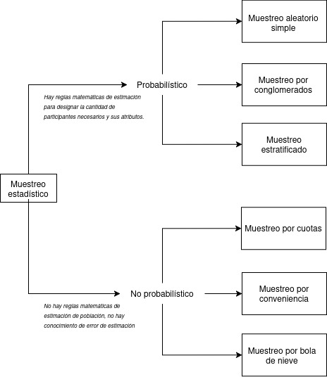
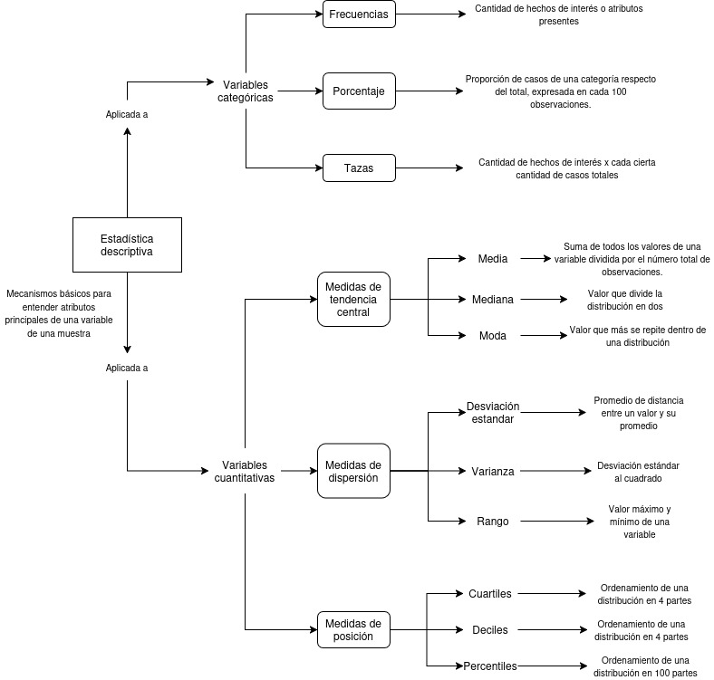

class:center, middle, bg_karl

```{r setup, include=FALSE}
options(htmltools.dir.version = FALSE)
knitr::opts_chunk$set(
  fig.width=9, fig.height=3.5, fig.retina=3,
  out.width = "100%",
  cache = FALSE,
  echo = FALSE,
  message = FALSE, 
  warning = FALSE,
  hiline = TRUE
)
```


```{r xaringan-themer, include=FALSE, warning=FALSE}
library(knitr)
library(xaringanthemer)
style_duo_accent(
  primary_color = "#b01333",
  secondary_color = "#085e9f",
  inverse_header_color = "#FFFFFF"
)
```
```{css, echo=F}
h1, h2, h3 {
  text-align: center;
}
```


```{css, echo = F}

.reduced_opacity {
  opacity: 0.05;
}


.bg_karl {
  position: relative;
  z-index: 1;
}
.bg_karl::before {    
      content: "";
      background-image: url('https://www.pewresearch.org/wp-content/uploads/2022/10/3-header_howPollingWorks.jpg');
      background-size: cover;
      position: absolute;
      top: 0px;
      right: 0px;
      bottom: 0px;
      left: 0px;
      opacity: 0.1;
      z-index: -1;
}
```

## Análisis estadístico y opinión Pública
### Clase 4: Introducción a la estadística descriptiva
#### Síntesis

<br>

#### Francisco Villarroel Riquelme (CICS- UDD) 
#### 


<br>
<br>
<br>
<br>
```{r, echo=FALSE, message = FALSE, out.width="30%", fig.align='center'}
knitr::include_graphics("clase4_files/Comunicaciones_udd.png")
```

---
background-image: url(clase4_files/Comunicaciones_udd.png)
background-size: 150px
background-position: 97% 97%
class: left, top


# ¿Qué veremos hoy?

- Repaso
- Ejercicios para el control

---
background-image: url(clase4_files/Comunicaciones_udd.png)
background-size: 150px
background-position: 97% 97%
class: left, top

## Un pequeño repaso

<br>

- Los métodos cuantitativos tienen como principio la medición de la realidad social
- Se usa para medir atributos de las personas y analizarlos a través del tiempo
- El proceso teórico principal es el de la _operacionalización_ (volver medibles teorías)
- La encuesta y la estadística son el mecanismo de recolección y de análisis más común


---
background-image: url(clase4_files/Comunicaciones_udd.png)
background-size: 150px
background-position: 97% 97%
class: left, top


# Repaso: Medición

--

- Cuando medimos, se obtienen variables agrupadas en dos grandes grupos: Cualitativas y cuantitativas
- Las variables cualitativas denonan _cualidades_ de las personas y sus atributos
- Las variables cuantitativas se centran en la medición más exacta de los atributos, preferencias y comportamientos de las personas
- Las variables cualitativas se dividen en nominales (categorías sin jerarquía) y ordinales (categorías con orden o jerarquía)
- Las variables cuantitativas se dividen en variables de razon (números con decimales) y numéricas discretas (números enteros)


---
background-image: url(clase4_files/Comunicaciones_udd.png)
background-size: 150px
background-position: 97% 97%
class: left, middle

## Repaso: Muestras

- Población (cantidad total de personas sujeto de ivnestigación) y muestra (subgrupo que se accede para estudiar un fenómeno)
- Para saber cuánta muestra necesito, debo considerar nivel de confianza y error de muestra
- **El nivel de confianza** es el cálculo probabilístico sobre si la muestra es representativa o no
- **El error de muestreo** es el error de estimaciòn admisible desde la muestra hacia la población

--

El muestreo más conocido es el _muestreo aleatorio simple_, donde todos tienen la misma probabilidad de ser elegidos.

--

Otros muestreos probabilísticos importantes: por conglomerado (niveles geográficos diferentes) y muestreo estratificado (variables sociales diferentes)

---

class: inverse, center, middle

```{r, out.width="80%", fig.align='center'}
knitr::include_graphics("https://www.questionpro.com/userimages/site_media/muestra-representativa.jpg")
```

---

background-image: url(clase4_files/Comunicaciones_udd.png)
background-size: 150px
background-position: 97% 97%
class:left, middle


```{r, out.width="40%",fig.align='center'}

```

---

background-image: url(clase4_files/Comunicaciones_udd.png)
background-size: 150px
background-position: 97% 97%
class:left, middle

## Corrección por población finita:


$$n= \frac{N * Z^2* p *(1-p)}{E^2(N - 1) + Z^2p(1-p)}$$
donde $N$ simplemente es la cantidad de población existente

---

```{r, out.width="60%", fig.align='center'}



```
---

---
background-image: url(clase4_files/Comunicaciones_udd.png)
background-size: 150px
background-position: 97% 97%
class: left, middle


## Ejemplo: empleo estratíficado en deportistas y funcionarios IND

- Ya sabemos que tenemos 2700 trabajadores, pero también sabemos que la proporción por sexo es 67% hombres y 33% mujeres.
- La encuesta puede ser sensible al género puedes hay razones para pensar que tienen problemáticas diferentes


¿Cuántas personas necesito considerando esto?

---
background-image: url(clase4_files/Comunicaciones_udd.png)
background-size: 150px
background-position: 97% 97%
class: left, middle

fórmula:

$$ n_h = \frac{N_h}{N} * n $$

$n_h$ = Tamaño de la muestra del estrato h

$N_j$ = Tamaño de la población del estrato h

$N$ = Tamaño población total

$n$ = Tamaño de la muestra total

---
class: left, middle


$$n_h = \frac{891}{2700}*366$$
--

$$n_h = 0.33 * 366 => n_h = 121$$

--

Para el resto es simplemente $366 - 121 = 245$

-- 

Entonces:

n de mujeres que deben ser encuestadas: 121
n de hombres que deben ser encuestados: 245


---
Ejercicio:

Calcule la media, mediana, moda y desviación estander de:


1: [167,174,175,170,185,173,170,171,158,164]

2: [164,169,167,172,160,163,157,163,180,180]

---

class: center, middle

# ¿Qué es una distribución?

> Cuando medimos algo en muchas personas, los valores no son todos iguales.  
> La **distribución** es simplemente *el patrón* de cómo se reparten esos valores.

---
class: center, middle

## De datos sueltos a una forma


```{r echo=FALSE, fig.width=11, fig.height=5, out.width="90%", fig.align='center'}
library(ggplot2)
library(gridExtra)

set.seed(7)
poblacion <- rlnorm(5000, meanlog = log(18), sdlog = 0.6)

# n=10
d10  <- data.frame(x = sample(poblacion, 10))
d100 <- data.frame(x = sample(poblacion, 100))
d500 <- data.frame(x = sample(poblacion, 500))

base_theme <- theme_minimal(base_size = 12) +
  theme(plot.title = element_text(face = "bold"),
        axis.title = element_blank())

p1 <- ggplot(d10, aes(x)) +
  geom_dotplot(fill = "#E74C3C", color = "white", binwidth = 4) +
  ggtitle("n = 10 personas") +
  labs(subtitle = "¿Ves algún patrón?") +
  scale_x_continuous(limits = c(0, 80)) +
  base_theme

p2 <- ggplot(d100, aes(x)) +
  geom_histogram(bins = 15, fill = "#3498DB", alpha = 0.7, color = "white") +
  ggtitle("n = 100 personas") +
  labs(subtitle = "Algo empieza a aparecer...") +
  scale_x_continuous(limits = c(0, 80)) +
  base_theme

p3 <- ggplot(d500, aes(x)) +
  geom_histogram(aes(y = ..density..), bins = 25,
                 fill = "#2ECC71", alpha = 0.7, color = "white") +
  geom_density(color = "#1a8a4a", linewidth = 1.3) +
  ggtitle("n = 500 personas") +
  labs(subtitle = "La forma se vuelve clara") +
  scale_x_continuous(limits = c(0, 80)) +
  base_theme

grid.arrange(p1, p2, p3, nrow = 1)
```

> **Minutos diarios viendo noticias** — cada barra agrupa a personas con valores similares.  
> Con más datos, emerge la **distribución**: la "firma estadística" de ese fenómeno.


---
background-image: url(clase4_files/Comunicaciones_udd.png)
background-size: 150px
background-position: 97% 97%
class: left, middle

# Propiedades de la Distribución Normal

- **Media, Mediana y Moda:** Todas son iguales y se encuentran en el centro de la distribución.
- **Unimodal:** Sólo hay un valor más repetido
- **Simetría:** Es perfectamente simétrica respecto a la media.
- **Curtosis:** Tiene una forma de campana, lo que significa que los datos se agrupan más cerca de la media.
- **Asintótica:** Las colas de la distribución se acercan al eje X pero nunca tocan.


---
background-image: url(clase4_files/Comunicaciones_udd.png)
background-size: 150px
background-position: 97% 97%
class: left, top

# Importancia de la Distribución Normal

- **Teorema del Límite Central:** Establece que la suma de un gran número de variables aleatorias independientes tiende a una distribución normal, sin importar la distribución original de las variables.
- **Modelos Estadísticos:** Muchos tests estadísticos y modelos están basados en la suposición de que los datos siguen una distribución normal.
- **Inferencia Estadística:** Permite hacer inferencias sobre la población basadas en muestras.


---
background-image: url(clase4_files/Comunicaciones_udd.png)
background-size: 150px
background-position: 97% 97%
class:left, top

# Visualización de Distribuciones Normales

```{r echo=FALSE, fig.cap="Distribuciones Normales con diferentes medias y desviaciones estándar"}
x <- seq(-10, 10, length=1000)
y1 <- dnorm(x, mean=0, sd=1)
y2 <- dnorm(x, mean=0, sd=2)
y3 <- dnorm(x, mean=2, sd=1)
plot(x, y1, type="l", col="blue", ylim=c(0, 0.5), ylab="Densidad", main="Distribuciones Normales")
lines(x, y2, col="red")
lines(x, y3, col="green")
legend("topright", legend=c("media=0, sd=1", "media=0, sd=2", "media=2, sd=1"), col=c("blue", "red", "green"), lty=1)
```

---
class: center, middle

### Visualización de Diferentes Distribuciones


```{r echo=FALSE, fig.width=10, fig.height=8, out.width="65%", fig.align='center'}
library(ggplot2)
library(gridExtra)

# Paleta de colores consistente
col1 <- "#E74C3C"; col2 <- "#3498DB"; col3 <- "#2ECC71"; col4 <- "#9B59B6"

# 1. Distribución Bimodal
set.seed(42)
bimodal_data <- c(rnorm(500, mean=3, sd=0.8), rnorm(500, mean=7, sd=0.8))
p1 <- ggplot(data.frame(x=bimodal_data), aes(x)) +
  geom_histogram(aes(y=..density..), bins=40, fill=col1, alpha=0.6, color="white") +
  geom_density(color=col1, linewidth=1.2) +
  ggtitle("Bimodal") +
  labs(subtitle="Dos grupos superpuestos", x=NULL, y="Densidad") +
  theme_minimal(base_size=13) +
  theme(plot.title=element_text(face="bold"))

# 2. Distribución Asimétrica positiva (Lognormal)
set.seed(42)
lognorm_data <- rlnorm(1000, meanlog=1, sdlog=0.7)
p2 <- ggplot(data.frame(x=lognorm_data), aes(x)) +
  geom_histogram(aes(y=..density..), bins=40, fill=col2, alpha=0.6, color="white") +
  geom_density(color=col2, linewidth=1.2) +
  ggtitle("Asimétrica positiva (Log-Normal)") +
  labs(subtitle="Cola larga a la derecha", x=NULL, y="Densidad") +
  theme_minimal(base_size=13) +
  theme(plot.title=element_text(face="bold"))

# 3. Distribución Uniforme / Flat
set.seed(42)
flat_data <- runif(1000, min=0, max=10)
p3 <- ggplot(data.frame(x=flat_data), aes(x)) +
  geom_histogram(aes(y=..density..), bins=20, fill=col3, alpha=0.6, color="white") +
  geom_hline(yintercept=0.1, color=col3, linewidth=1.2, linetype="dashed") +
  ggtitle("Plana (Uniforme)") +
  labs(subtitle="Igual probabilidad en todo el rango", x=NULL, y="Densidad") +
  theme_minimal(base_size=13) +
  theme(plot.title=element_text(face="bold"))

# 4. Distribución con colas pesadas (t de Student con pocos grados de libertad)
set.seed(42)
heavy_data <- rt(1000, df=3)
heavy_data <- heavy_data[abs(heavy_data) < 8]  # recortar outliers extremos para visualización
p4 <- ggplot(data.frame(x=heavy_data), aes(x)) +
  geom_histogram(aes(y=..density..), bins=40, fill=col4, alpha=0.6, color="white") +
  geom_density(color=col4, linewidth=1.2) +
  ggtitle("Colas Pesadas (t de Student, df=3)") +
  labs(subtitle="Eventos extremos más frecuentes", x=NULL, y="Densidad") +
  theme_minimal(base_size=13) +
  theme(plot.title=element_text(face="bold"))

grid.arrange(p1, p2, p3, p4, ncol=2)
```


---
class: inverse, center, middle

## Ejemplos de distribuciones normales


---

```{r echo=FALSE, fig.width=10, fig.height=8, out.width="75%", fig.align='center'}
library(ggplot2)
library(gridExtra)

col1 <- "#E74C3C"; col2 <- "#3498DB"; col3 <- "#2ECC71"; col4 <- "#9B59B6"

# 1. BIMODAL: Polarización de opinión pública
# Calibrado con datos tipo ANES: distribución bimodal en temas valóricos
# (ej: aborto, matrimonio igualitario) — literatura DiMaggio et al. 1996
set.seed(42)
izq  <- rnorm(500, mean = 2.0, sd = 0.6)   # polo progresista
der  <- rnorm(500, mean = 4.0, sd = 0.6)   # polo conservador
polar_data <- data.frame(x = c(izq, der))

p1 <- ggplot(polar_data, aes(x)) +
  geom_histogram(aes(y = ..density..), bins = 35,
                 fill = col1, alpha = 0.6, color = "white") +
  geom_density(color = col1, linewidth = 1.2) +
  scale_x_continuous(
    limits = c(1, 5),
    breaks = c(1, 2, 3, 4, 5),
    labels = c("Muy\nen contra", "", "Neutro", "", "Muy\na favor")
  ) +
  ggtitle("Bimodal: Polarización de opinión") +
  labs(subtitle = "Tema valórico en encuesta (tipo ANES/CADEM)",
       x = NULL, y = "Densidad") +
  theme_minimal(base_size = 12) +
  theme(plot.title = element_text(face = "bold"))

# 2. POWER LAW: Seguidores en redes sociales (Zipf/Pareto)
# Empírico: distribución de seguidores en Twitter/Instagram sigue power law
# Fuente: Zipf's Law across social media (2022)
set.seed(42)
alpha  <- 2.2
xmin   <- 100
n      <- 2000
u      <- runif(n)
seguidores <- xmin * (1 - u)^(-1 / (alpha - 1))
seguidores <- seguidores[seguidores < 500000]  # recortar extremo visual

p2 <- ggplot(data.frame(x = seguidores), aes(x)) +
  geom_histogram(aes(y = ..density..), bins = 60,
                 fill = col2, alpha = 0.6, color = "white") +
  scale_x_continuous(labels = scales::comma) +
  ggtitle("Power Law: Seguidores en RRSS") +
  labs(subtitle = "Distribución de seguidores (Twitter/Instagram)",
       x = "N° de seguidores", y = "Densidad") +
  theme_minimal(base_size = 12) +
  theme(plot.title = element_text(face = "bold"))

# 3. LOGNORMAL: Tiempo de exposición a noticias
# Calibrado con estudios de news exposure:
# mediana ~1.5 min, cola larga (algunos leen mucho, mayoría poco)
set.seed(42)
tiempo <- rlnorm(1000, meanlog = log(1.5), sdlog = 1.1)
tiempo <- tiempo[tiempo < 25]  # minutos plausibles

p3 <- ggplot(data.frame(x = tiempo), aes(x)) +
  geom_histogram(aes(y = ..density..), bins = 40,
                 fill = col3, alpha = 0.6, color = "white") +
  geom_density(color = col3, linewidth = 1.2) +
  ggtitle("Log-Normal: Tiempo leyendo noticias") +
  labs(subtitle = "Minutos de exposición por visita (mediana ~1.5 min)",
       x = "Minutos", y = "Densidad") +
  theme_minimal(base_size = 12) +
  theme(plot.title = element_text(face = "bold"))

# 4. UNIFORME: Respuesta a escala Likert en tema de baja implicación
# Cuando un tema no activa actitudes fuertes, las respuestas se
# distribuyen de forma aproximadamente plana (indiferencia generalizada)
set.seed(42)
likert_data <- sample(1:5, 800, replace = TRUE,
                      prob = c(0.19, 0.20, 0.22, 0.20, 0.19))

p4 <- ggplot(data.frame(x = likert_data), aes(x)) +
  geom_bar(aes(y = ..count.. / sum(..count..)),
           fill = col4, alpha = 0.6, color = "white", width = 0.6) +
  geom_hline(yintercept = 0.20, color = col4,
             linewidth = 1.2, linetype = "dashed") +
  scale_x_continuous(
    breaks = 1:5,
    labels = c("Muy en\ndesacuerdo", "En\ndesacuerdo",
               "Neutro", "De\nacuerdo", "Muy de\nacuerdo")
  ) +
  scale_y_continuous(labels = scales::percent_format()) +
  ggtitle("Plana: Likert en tema de baja implicación") +
  labs(subtitle = "Sin actitud formada → respuestas equiprobables",
       x = NULL, y = "Proporción") +
  theme_minimal(base_size = 12) +
  theme(plot.title = element_text(face = "bold"),
        axis.text.x = element_text(size = 9))

grid.arrange(p1, p2, p3, p4, ncol = 2)
```


---
class: inversed, center, middle
background-image: url(https://user-images.githubusercontent.com/163582/45438104-ea200600-b67b-11e8-80fa-d9f2a99a03b0.png)
background-size: 80px
background-position: 50% 90%

# ¡Gracias!


###fvillarroelr@udd.cl

Slide creado con el paquete [**xaringan**](https://github.com/yihui/xaringan).


El  chakra viene de [remark.js](https://remarkjs.com), [**knitr**](https://yihui.org/knitr/), y [R Markdown](https://rmarkdown.rstudio.com).
Este slide fue creado por [**xaringan**](https://github.com/yihui/xaringan) y [**XaringanThemer**](https://pkg.garrickadenbuie.com/xaringanthemer/index.html)
