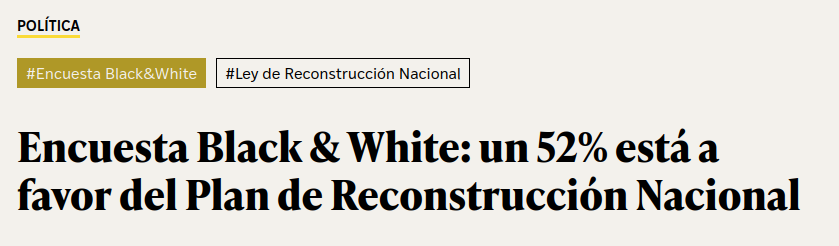
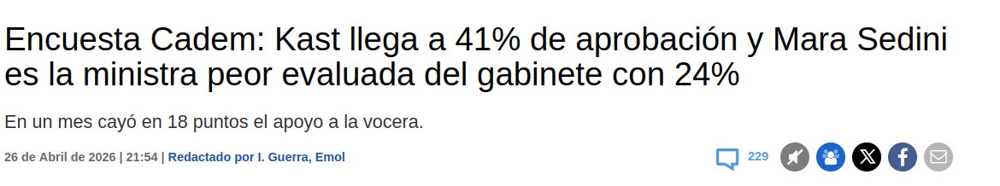
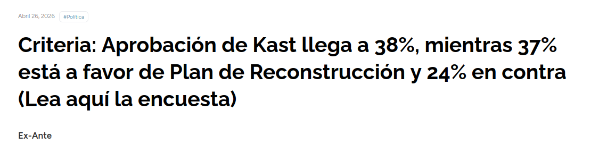
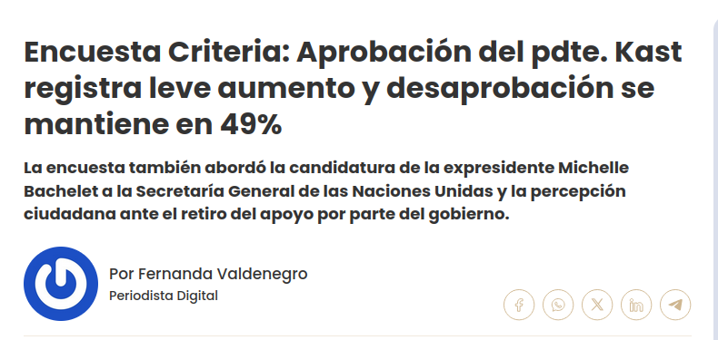
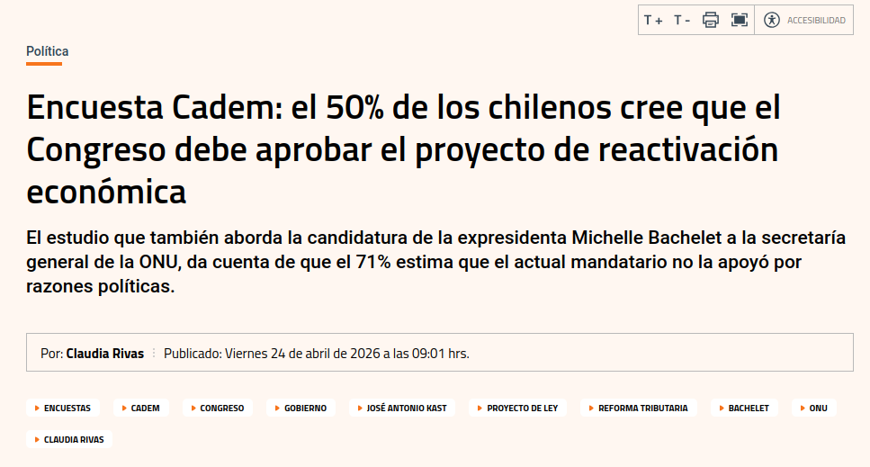

class: left, middle, bg_opinon

```{r setup, include=FALSE}
options(htmltools.dir.version = FALSE)
knitr::opts_chunk$set(
  fig.width=9, fig.height=3.5, fig.retina=3,
  out.width = "100%",
  cache = FALSE,
  echo = TRUE,
  message = FALSE, 
  warning = FALSE,
  hiline = TRUE
)
```

```{r xaringan-themer, include=FALSE, warning=FALSE}
library(xaringanthemer)
style_duo_accent(
  primary_color = "#b01333",
  secondary_color = "#085e9f",
  inverse_header_color = "#FFFFFF"
)
```

```{css, echo=F}
.bg_opinon {
  position: relative;
  z-index: 1;
}
.bg_opinon::before {
  content: "";
  background-image: url('https://www.pewresearch.org/wp-content/uploads/2022/10/3-header_howPollingWorks.jpg');
  background-size: cover;
  background-position: center;
  position: absolute;
  top: 0px; right: 0px; bottom: 0px; left: 0px;
  opacity: 0.15;
  z-index: -1;
}
.definition-box {
  background: #fdecea;
  border-left: 5px solid #b01333;
  border-radius: 0 8px 8px 0;
  padding: 14px 18px;
  margin: 10px 0;
  font-size: 0.88em;
}
.highlight-box {
  background: #eaf2fb;
  border: 2px solid #085e9f;
  border-radius: 8px;
  padding: 12px 16px;
  margin: 12px 0;
  font-size: 0.85em;
}
.warning-box {
  background: #fef9e7;
  border-left: 5px solid #f39c12;
  border-radius: 0 8px 8px 0;
  padding: 12px 16px;
  margin: 12px 0;
  font-size: 0.85em;
}
.two-col {
  display: grid;
  grid-template-columns: 1fr 1fr;
  gap: 20px;
  align-items: start;
}
.three-col {
  display: grid;
  grid-template-columns: 1fr 1fr 1fr;
  gap: 16px;
}
.card {
  background: white;
  border-radius: 10px;
  padding: 14px;
  box-shadow: 0 2px 8px rgba(176,19,51,0.12);
  font-size: 0.84em;
}
.card-red   { border-top: 4px solid #b01333; }
.card-blue  { border-top: 4px solid #085e9f; }
.card-orange{ border-top: 4px solid #e67e22; }
.card-green { border-top: 4px solid #1e8449; }
.badge {
  display: inline-block;
  background: #b01333;
  color: white;
  border-radius: 20px;
  padding: 3px 12px;
  font-size: 0.78em;
  font-weight: bold;
  margin-right: 6px;
}
.badge-blue  { background: #085e9f; }
.badge-green { background: #1e8449; }
.step {
  display: flex;
  align-items: flex-start;
  margin-bottom: 10px;
  gap: 12px;
}
.step-num {
  background: #b01333;
  color: white;
  border-radius: 50%;
  width: 28px; height: 28px;
  display: flex;
  align-items: center;
  justify-content: center;
  font-weight: bold;
  flex-shrink: 0;
  font-size: 0.9em;
}
.footnote-small {
  font-size: 0.68em;
  color: #777;
  border-top: 1px solid #DDD;
  padding-top: 6px;
  margin-top: 6px;
}
table { font-size: 0.82em; width: 100%; border-collapse: collapse; }
th { background: #b01333; color: white; padding: 7px 10px; text-align: left; }
td { padding: 6px 10px; border-bottom: 1px solid #e0e0e0; }
tr:nth-child(even) { background: #fdf3f4; }
blockquote {
  border-left: 4px solid #085e9f;
  background: #eaf2fb;
  padding: 10px 16px;
  border-radius: 0 8px 8px 0;
  font-style: italic;
  color: #333;
  margin: 10px 0;
  font-size: 0.90em;
}
h1, h2, h3 { color: #b01333; }
.big-number {
  font-size: 3em;
  font-weight: bold;
  color: #b01333;
  line-height: 1;
}
.center-content {
  text-align: center;
}
.red { color: #b01333; font-weight: bold; }
.blue { color: #085e9f; font-weight: bold; }
.green { color: #1e8449; font-weight: bold; }
.orange { color: #e67e22; font-weight: bold; }
```

---
class: left, middle, bg_opinon

# Análisis Estadístico y Opinión Pública
## Clase 8: Escritura con Cifras y Evaluación Crítica de Datos

**Francisco Villarroel Riquelme** | CICS — UDD | `r Sys.Date()`

---

## Hoja de ruta de hoy

.two-col[
.card.card-red[
### Bloque 1 
**Conceptos y herramientas**

1. ¿Por qué importa escribir bien con cifras?
2. Reglas básicas de escritura con números
3. Titulares y mensajes clave con datos
4. Manuales de estilo y verificación
5. Riesgos éticos del mal uso
]

.card.card-blue[
### Bloque 2 
**Taller práctico**

1. Revisión de estudios de OOPP reales en Chile
2. Análisis crítico guiado
3. Ejercicio grupal: evalúa un titular
4. Presentación y discusión
5. Cierre y síntesis
]
]


---
class: inverse, center, middle

## Escritura y comunicación con cifras

---

## ¿Por qué es difícil escribir con cifras?

.two-col[
.card.card-red[
### El problema cognitivo
Los números son abstractos. El cerebro humano no procesa de forma intuitiva diferencias como:
- 1.000.000 vs 1.500.000
- 12,4% vs 14,1%
- "Aumentó en 3 puntos" vs "casi se triplicó"

**El comunicador debe hacer ese trabajo por el lector**
]

.card.card-blue[
### El problema de poder
Los datos **nunca son neutros**. Siempre hay alguien que:
- Elige qué medir
- Elige cómo presentarlo
- Elige qué comparar
- Elige qué omitir

**Todo dato publicado es también una decisión editorial**
]
]

.highlight-box[
Revisemos algún titular confuso o engañoso
]

---

## Reglas básicas: escritura con números

.two-col[
.card.card-red[
### Reglas de forma
- Del 1 al 9: se escriben en letras (**tres**, **siete**)
- Del 10 en adelante: en cifras (**12**, **235**)
- Nunca iniciar oración con un número — reordenar la frase
- Porcentajes: **37%** (no "37 por ciento" en datos duros)
- Decimales: usar coma en español (**3,5%**), no punto
- Miles: punto separador (**1.250.000** personas)
]

.card.card-blue[
### Reglas de contexto
- Siempre indicar el **universo**: *"3 de cada 10 chilenos"* ≠ *"el 30%"*
- Indicar **cuándo** se midió: los datos envejecen
- Indicar **quién** midió: la fuente cambia el significado
- Incluir **margen de error** si existe
- Indicar si es dato muestral o censal
]
]

.warning-box[
️ **Error clásico:** decir "aumentó un 200%" cuando la cifra base era muy pequeña. Un aumento de 1 a 3 casos es 200%, pero sigue siendo 3 casos.
]

---

## El número solo nunca basta

.three-col[
.card.card-red[
### ❌ Sin contexto
*"El 68% aprueba la medida"*

¿Quién fue encuestado? ¿Cuándo? ¿Cuál medida? ¿Qué significa "aprueba"?
]

.card.card-orange[
### ⚠️ Con contexto parcial
*"El 68% de los chilenos aprueba la nueva ley de pensiones según encuesta de enero 2024"*

Mejor, pero: ¿quién encuestó? ¿cuántos? ¿con qué pregunta exacta?
]

.card.card-green[
### ✅ Con contexto completo
*"El 68% de los encuestados aprueba la nueva ley de pensiones (Cadem, enero 2024, n=1.034, margen ±3,1 pp), pregunta: '¿Aprueba o rechaza...?'"*
]
]

<br>

.definition-box[
**Regla de oro:** Si no puedes responder *¿quién midió, cuándo, a quién, cómo?*, el dato no está listo para ser publicado.
]

---

## Titulares con datos: el arte de no mentir (ni aburrir)

.two-col[
.card.card-blue[
### Tipos de titulares con cifras

**1. El titular exacto** → Útil para noticias técnicas  
*"Inflación sube 0,4 puntos en marzo"*

**2. El titular humanizado** → Más accesible  
*"4 de cada 10 chilenos no llega a fin de mes"*

**3. El titular de cambio** → Muestra tendencia  
*"Aprobación presidencial cae 8 puntos en un mes"*

**4. El titular comparativo** → Da perspectiva  
*"Chile lidera ranking de desigualdad entre países OCDE"*
]

.card.card-red[
### Titulares peligrosos

**El sensacionalista:**  
*"¡Aumentó un 400%!"* → ¿Desde qué base?

**El descontextualizado:**  
*"La mayoría rechaza..."* → ¿51% o 90%?

**El atemporal:**  
*"Encuesta revela que..."* → ¿De cuándo?

**El de causa-efecto falso:**  
*"Los que ven TV tienen más ansiedad"* → Correlación ≠ causalidad

]
]

---


.pull-left[


```{r, echo=FALSE, out.width="120%", fig.align='center'}

```

<br>
<br>


```{r, echo=FALSE, out.width="120%", fig.align='center'}


```

]

.pull-right[
```{r, echo=FALSE, out.width="120%", fig.align='center'}


```

<br>
<br>

```{r,echo=FALSE, out.width="120%", fig.align='center'}

```


]

---


```{r,echo=FALSE, out.width="90%", fig.align='center'}

```


[Rara forma de presentar datos](https://www.df.cl/economia-y-politica/politica/encuesta-cadem-el-50-de-los-chilenos-cree-que-el-congreso-debe-aprobar-el)

---

## Ejercicio rápido: ¿Qué titular publicarías?

**Datos disponibles:** Encuesta CEP, diciembre 2023. N=1.505 personas. Pregunta: *"¿Cuál es el principal problema del país?"*

| Problema | % |
|---|---|
| Delincuencia y seguridad | 74% |
| Pensiones y vejez | 38% |
| Economía y empleo | 31% |
| Salud | 22% |
| Corrupción | 18% |

.highlight-box[
**En parejas (3 minutos):** Redacten DOS titulares diferentes para este dato. Uno "amarillista" y uno riguroso. ¿Qué cambia? ¿Por qué?
]

---

## Manuales de estilo y verificación de cifras

.two-col[
.card.card-blue[
### ¿Qué es un manual de estilo?
Conjunto de normas que una organización periodística o comunicacional adopta para **estandarizar** cómo se presentan los datos.

**Ejemplos reales:**
- [Manual de Estilo del diario *El País* (España)](https://www.u-cursos.cl/derecho/2023/2/D125T07583/1/material_docente/bajar?id=6906989&lsar=1&file=0)
- Associated Press Stylebook (EE.UU.)
- Manual de Normas de La Tercera (Chile)
- Guías internas de ministerios y servicios

]

.card.card-red[
### ¿Qué regulan en materia de cifras?
- Cuándo usar números vs letras
- Cómo presentar porcentajes y puntos porcentuales
- Cómo citar fuentes estadísticas
- Cuándo incluir margen de error
- Cómo escribir fechas y rangos temporales
- Qué comparaciones son legítimas

]
]

.definition-box[
 **Punto vs porcentaje:** *"La aprobación subió 10 puntos porcentuales"* (de 40% a 50%) es distinto a *"subió un 10%"* (de 40% a 44%). **Nunca son equivalentes.**
]

---

## Checklist de verificación antes de publicar un dato

.two-col[
<div class="step">
  <div class="step-num">1</div>
  <div><strong>Fuente primaria</strong>: ¿Tengo acceso al informe original, no solo al comunicado de prensa?</div>
</div>
<div class="step">
  <div class="step-num">2</div>
  <div><strong>Metodología</strong>: ¿Sé cómo se recogió el dato? (encuesta, censo, registro administrativo)</div>
</div>
<div class="step">
  <div class="step-num">3</div>
  <div><strong>Fecha</strong>: ¿Cuándo se recolectó? ¿Sigue siendo válido?</div>
</div>
<div class="step">
  <div class="step-num">4</div>
  <div><strong>Universo</strong>: ¿A quiénes representa? ¿Tiene representatividad nacional, regional, etc.?</div>
</div>

.card.card-blue[
<div class="step">
  <div class="step-num">5</div>
  <div><strong>Pregunta exacta</strong>: ¿Cuál fue el enunciado exacto? Las palabras cambian todo.</div>
</div>
<div class="step">
  <div class="step-num">6</div>
  <div><strong>Margen de error</strong>: ¿Existe? ¿Es relevante para la diferencia que se está destacando?</div>
</div>
<div class="step">
  <div class="step-num">7</div>
  <div><strong>Comparabilidad</strong>: ¿Se puede comparar con datos anteriores? ¿La metodología es la misma?</div>
</div>
<div class="step">
  <div class="step-num">8</div>
  <div><strong>Interés detrás</strong>: ¿Quién financia o encarga el estudio? ¿Hay conflicto de interés?</div>
</div>
]
]

---

## Riesgos éticos del uso indebido de datos

.three-col[
.card.card-red[
### Manipulación
Seleccionar solo los datos que convienen, ignorar los que contradicen la tesis.

*Ejemplo: publicar solo el subgrupo donde la aprobación es más alta*
]

.card.card-orange[
### Engaño visual
Gráficos con ejes truncados, escalas distorsionadas o comparaciones incomparables.

*Ejemplo: eje Y que empieza en 60% para exagerar diferencias pequeñas*
]

.card.card-blue[
### Causalidad falsa
Presentar correlaciones estadísticas como si fueran relaciones causa-efecto.

*Ejemplo: "los países con mayor consumo de chocolate tienen más premios Nobel" — es real, es absurdo*
]
]

<br>

.warning-box[
 **El riesgo institucional:** Organismos públicos, partidos políticos y empresas utilizan datos para legitimar decisiones ya tomadas. El comunicador tiene responsabilidad de evaluar ese uso, no solo replicarlo.
]

---

## Tipos de documentos cuantitativos que vas a encontrar

| Tipo | Ejemplo chileno | Qué evaluar |
|------|----------------|-------------|
| **Encuesta de opinión** | CEP, Cadem, Criteria, UDD | Muestra, pregunta, financiamiento |
| **Censo** | INE, Censo 2017 | Cobertura, fecha, variables |
| **Encuesta temática** | CASEN, ENS, ENUSC | Metodología longitudinal |
| **Ranking** | Ranking universidades, índice de competitividad | Criterios de ponderación |
| **Indicador compuesto** | IDH, Índice de Paz Global | Qué incluye y qué excluye |
| **Registro administrativo** | Datos FONASA, SII, Carabineros | Sesgo de registro |
| **Estudio de ONG o think tank** | CIPER, Espacio Público, LyD | Financiamiento e ideología |

<br>
<br>
<br>

.footnote-small[Cada tipo tiene sus propias fortalezas y limitaciones. No existe el dato perfecto.]

---
class: inverse, center, middle

## Taller práctico: Evaluación crítica de estudios de OOPP en Chile

---

## ¿Qué es la opinión pública medida?

.definition-box[
La **opinión pública medida** es la distribución estadística de respuestas a preguntas formuladas bajo condiciones metodológicas específicas. No es "lo que piensa la gente", es **una fotografía con muchas decisiones de encuadre**.
]

.two-col[
.card.card-blue[
### Los grandes estudios en Chile
- **CEP** — Centro de Estudios Públicos (bianual)
- **Cadem** — Plaza Pública (semanal)
- **Criteria** — Varios estudios temáticos
- **Activa Research** — Barómetro y ENUSC
- **CASEN** — Encuesta ministerial sobre pobreza
- **ENUSC** — Encuesta de victimización Subsecretaría Prevención del Delito
]

.card.card-red[
### Sus diferencias clave
- Frecuencia: ¿semanal, mensual, bianual?
- Muestra: ¿cuántos? ¿cómo seleccionados?
- Modo: ¿presencial, telefónico, online?
- Financiamiento: ¿quién paga?
- Preguntas: ¿cerradas, abiertas, sugeridas?
]
]

---

### Caso 1: La encuesta CEP

.two-col[

.highlight-box[
**Organismo:** Centro de Estudios Públicos; **Periodicidad:** trimestral (?); **Muestra:** +/- 1.400 personas, representativa nacional; **Modo:** cara a cara en hogares; **Financiamiento:** CEP (think tank independiente de centroderecha con financiamiento privado)

 ]

.card.card-blue[
### Fortalezas
- Metodología robusta y consistente desde 1987
- Serie histórica muy larga → permite comparar
- Preguntas estandarizadas y documentadas
- Alta credibilidad en academia y medios
]
]

.card.card-orange[
### Preguntas críticas que deberías hacerte
- ¿Refleja lo mismo entrevistar presencialmente que por teléfono?
- ¿El financiamiento privado-liberal influye en qué preguntas se hacen y cuáles no?
- ¿La periodicidad trimestral es suficiente en períodos de alta volatilidad?
- ¿Qué grupos quedan subrepresentados en una muestra "representativa nacional"?
]

.footnote-small[Fuente: cepchile.cl]

---

### Caso 2: Plaza Pública Cadem

.two-col[

.highight-box[
**Datos técnicos:**
- Organismo: Cadem (empresa privada de investigación de mercado)
- Periodicidad: semanal (desde 2013)
- Muestra: ~600-700 personas por semana
- Modo: telefónico (RDD + celular) y online
- Financiamiento: empresa privada, clientes corporativos y políticos

]

.card.card-red[
### Tensiones metodológicas
- Muestra más pequeña → mayor margen de error (Supone un ~±4%, pero incomprobable)
- Modo telefónico sesga hacia adultos con teléfono fijo/celular
- Alta frecuencia genera fluctuaciones por "ruido estadístico"
- Los medios la usan como "temperatura semanal" aunque no tiene esa precisión
]
]

.highlight-box[
**Para discutir:** ¿Es responsable publicar variaciones semanales de 2-3 puntos en aprobación presidencial cuando el margen de error es ±4 puntos? ¿Qué narrativa construye eso?
]

---

## Caso 3: CASEN — La encuesta más política de Chile

.definition-box[
La **Encuesta de Caracterización Socioeconómica Nacional (CASEN)** es el instrumento oficial para medir pobreza, desigualdad y condiciones de vida en Chile. La aplica el Ministerio de Desarrollo Social, pero la ejecuta una universidad externa.
]

.two-col[
.card.card-blue[
### ¿Por qué es "política"?
- Define oficialmente **quién es pobre** en Chile
- Determina quién accede a subsidios y programas sociales
- Cada gobierno puede cambiar metodologías → cambia el resultado
- Las cifras de reducción de pobreza son logros (o fracasos) de gestión
]

.card.card-red[
### Controversias históricas
- 2013: cambio metodológico que aumentó artificialmente la pobreza y fue revertido
- Debate sobre pobreza "multidimensional" vs. solo ingreso
- Tensión entre continuidad histórica y actualización metodológica
- ¿Quién decide qué umbrales definen la pobreza?
]
]

---

## Ejercicio grupal: Evaluación crítica

.highlight-box[
### Instrucciones (20 minutos)

En grupos de 3-4 personas, analicen el siguiente titular y el estudio que lo respalda:

**Titular:** *"Chile es el segundo país más inseguro de Sudamérica según encuesta de victimización"*

**Datos del estudio:**
- Fuente: ONG internacional con sede en EE.UU.
- Muestra: 500 personas por país, vía online
- Pregunta: *"¿Siente que su país es seguro?"* (escala 1-5)
- Fecha: agosto 2023
- Financiamiento: empresa privada de seguridad privada

**Respondan:**
1. ¿Qué preguntas críticas harían sobre metodología?
2. ¿Qué información falta para evaluar el dato?
3. ¿Publicarían este titular? ¿Cómo lo modificarían?
4. ¿Qué interés puede tener el financiador en este resultado?
]

---

## Grilla de evaluación crítica (herramienta para usar siempre)

| Dimensión | Preguntas clave | Alerta si... |
|-----------|----------------|--------------|
| **Fuente** | ¿Quién produce el dato? ¿Con qué recursos? | El financiador se beneficia del resultado |
| **Muestra** | ¿Quiénes fueron encuestados? ¿Cómo se seleccionaron? | N < 400 o selección no probabilística |
| **Pregunta** | ¿Cuál fue el enunciado exacto? | La pregunta sugiere una respuesta (sesgo de encuadre) |
| **Contexto temporal** | ¿Cuándo se midió? ¿Qué pasaba entonces? | Más de 6 meses de antigüedad en temas volátiles |
| **Comparabilidad** | ¿Es comparable con otras mediciones? | Cambio de metodología no declarado |
| **Presentación** | ¿El gráfico o titular representa fielmente el dato? | Eje Y truncado, porcentajes que no suman 100% |
| **Omisiones** | ¿Qué datos del mismo estudio no se mencionan? | Solo se citan los resultados favorables |

---

### Los errores más comunes en medios chilenos

.three-col[
.card.card-red[
#### 1. Confundir pp con %
*"La aprobación cayó un 5%"*  
vs  
*"cayó 5 puntos porcentuales"*

De 50% a 45%: son 5 pp, pero es una caída del 10% relativo
]

.card.card-orange[
#### 2. Olvidar el margen de error
Si dos candidatos tienen 32% y 30% con margen ±3%, **están empatados estadísticamente**. Los medios casi nunca lo dicen.
]

.card.card-blue[
#### 3. Correlación = causalidad
*"Jóvenes que usan redes sociales tienen más depresión"* 

¿Causa la red social la depresión o la depresión lleva a usar más redes sociales?
]
]

<br>

.card.card-green[
#### 4. El promedio que oculta
El ingreso promedio de Chile puede ser alto, pero si hay alta desigualdad, la mayoría gana mucho menos que el promedio. La **mediana** suele ser más honesta que la media en distribuciones asimétricas.
]

---

## Revisión de titular real: práctica final

.warning-box[
### Ejercicio individual (10 minutos)

Tomando el siguiente texto de un comunicado de prensa oficial, redacten:
1. Un párrafo de contexto metodológico
2. Un titular riguroso
3. Un párrafo de análisis crítico

**Comunicado:** *"Según la última encuesta del Ministerio del Interior, el 78% de los chilenos considera que la delincuencia aumentó en el último año. La encuesta fue realizada entre el 1 y 15 de octubre de 2023 a 1.200 personas mayores de 18 años en zonas urbanas del país."*

**Pista:** ¿Qué preguntas te surgen? ¿Qué falta saber?
]

---

## Cierre: lo que un comunicador debe poder hacer

.two-col[
.card.card-blue[
### Con cualquier dato, debes poder responder:

1. Quién lo produjo y con qué interés?  
2. Cómo se midió y cuáles son sus limitaciones?  
3. A quién representa el dato?  
4. Cuándo se tomó y sigue siendo válido?  
5. La presentación es fiel al resultado?  
6. Qué se omite y por qué?  
]

.card.card-red[
### Recuerda:

> *"No existen datos inocentes. Todo número es el resultado de decisiones humanas: qué medir, cómo medirlo, cómo presentarlo y para quién."*

La responsabilidad del comunicador no es solo **reportar el dato**, sino **contextualizarlo éticamente**.
]
]

---
class: center, middle
background-image: url(https://user-images.githubusercontent.com/163582/45438104-ea200600-b67b-11e8-80fa-d9f2a99a03b0.png)
background-size: 80px
background-position: 50% 90%

# ¡Gracias!

### fvillarroelr@udd.cl

Slide creado con [**xaringan**](https://github.com/yihui/xaringan) y [**XaringanThemer**](https://pkg.garrickadenbuie.com/xaringanthemer/index.html)