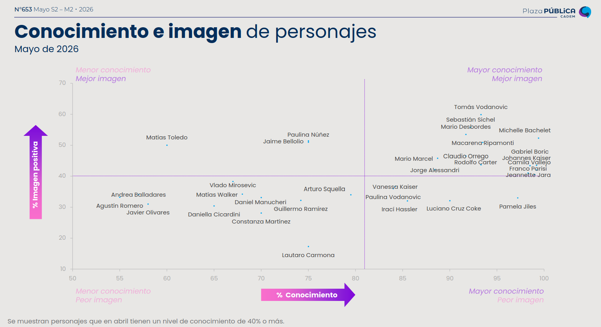
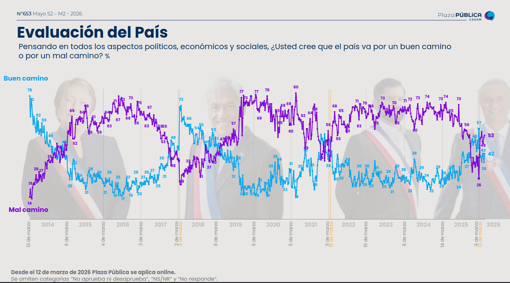
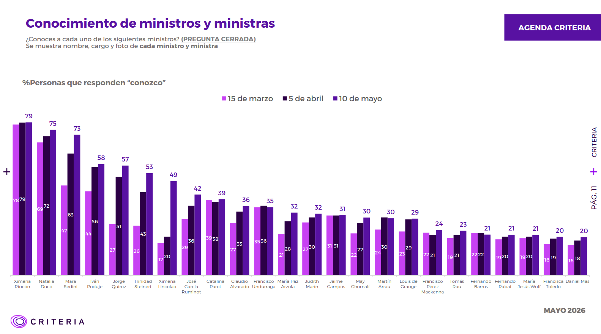

```{r setup, include=FALSE}
options(htmltools.dir.version = FALSE)
knitr::opts_chunk$set(
  fig.width=9, fig.height=3.5, fig.retina=3,
  out.width = "100%",
  cache = FALSE,
  echo = FALSE,
  message = FALSE,
  warning = FALSE,
  hiline = TRUE
)
library(ggplot2)
library(dplyr)
library(forcats)
library(tidyr)
library(scales)
library(gridExtra)
library(ggforce)
```

```{r xaringan-themer, include=FALSE, warning=FALSE}
library(xaringanthemer)
style_duo_accent(
  primary_color   = "#b01333",
  secondary_color = "#085e9f",
  inverse_header_color = "#FFFFFF"
)
```

```{css, echo=F}
h1, h2, h3 { text-align: center; }

.bg_portada {
  position: relative;
  z-index: 1;
}
.bg_portada::before {
  content: "";
  background-image: url('https://images.unsplash.com/photo-1551288049-bebda4e38f71?w=1400');
  background-size: cover;
  background-position: center;
  position: absolute;
  top: 0px; right: 0px; bottom: 0px; left: 0px;
  opacity: 0.15;
  z-index: -1;
}
.definition-box {
  background: #fdf2f3;
  border-left: 5px solid #b01333;
  border-radius: 0 8px 8px 0;
  padding: 14px 18px;
  margin: 10px 0;
  font-size: 0.88em;
}
.highlight-box {
  background: #fef9e7;
  border: 2px solid #f39c12;
  border-radius: 8px;
  padding: 12px 16px;
  margin: 12px 0;
  font-size: 0.85em;
}
.info-box {
  background: #eaf2fb;
  border-left: 5px solid #085e9f;
  border-radius: 0 8px 8px 0;
  padding: 12px 16px;
  margin: 12px 0;
  font-size: 0.85em;
}
.danger-box {
  background: #fdf2f3;
  border: 2px solid #b01333;
  border-radius: 8px;
  padding: 12px 16px;
  margin: 12px 0;
  font-size: 0.85em;
}
.success-box {
  background: #eafaf1;
  border: 2px solid #1e8449;
  border-radius: 8px;
  padding: 12px 16px;
  margin: 12px 0;
  font-size: 0.85em;
}
.two-col {
  display: grid;
  grid-template-columns: 1fr 1fr;
  gap: 20px;
  align-items: start;
}
.three-col {
  display: grid;
  grid-template-columns: 1fr 1fr 1fr;
  gap: 16px;
}
.card {
  background: white;
  border-radius: 10px;
  padding: 14px;
  box-shadow: 0 2px 8px rgba(176,19,51,0.12);
  font-size: 0.84em;
}
.card-red   { border-top: 4px solid #b01333; }
.card-blue  { border-top: 4px solid #085e9f; }
.card-green { border-top: 4px solid #1e8449; }
.card-orange{ border-top: 4px solid #e67e22; }
.badge {
  display: inline-block;
  background: #b01333;
  color: white;
  border-radius: 20px;
  padding: 3px 12px;
  font-size: 0.78em;
  font-weight: bold;
  margin-right: 6px;
}
.badge-blue  { background: #085e9f; }
.badge-green { background: #1e8449; }
.badge-orange{ background: #e67e22; }
.step {
  display: flex;
  align-items: flex-start;
  margin-bottom: 10px;
  gap: 12px;
}
.step-num {
  background: #b01333;
  color: white;
  border-radius: 50%;
  width: 28px; height: 28px;
  display: flex;
  align-items: center;
  justify-content: center;
  font-weight: bold;
  flex-shrink: 0;
  font-size: 0.9em;
}
.footnote-small {
  font-size: 0.68em;
  color: #777;
  border-top: 1px solid #DDD;
  padding-top: 6px;
  margin-top: 6px;
}
table {
  font-size: 0.78em;
  width: 100%;
  border-collapse: collapse;
}
th {
  background: #b01333;
  color: white;
  padding: 7px 10px;
  text-align: left;
}
td { padding: 6px 10px; border-bottom: 1px solid #e0e0e0; }
tr:nth-child(even) { background: #f5f7fa; }
blockquote {
  border-left: 4px solid #b01333;
  background: #fdf2f3;
  padding: 10px 16px;
  border-radius: 0 8px 8px 0;
  font-style: italic;
  color: #333;
  margin: 10px 0;
  font-size: 0.90em;
}
.timer-box {
  background: #1a1a2e;
  color: #e0e0e0;
  border-radius: 10px;
  padding: 14px 18px;
  font-size: 0.85em;
  border-left: 5px solid #f39c12;
}
```

---
class: left, middle, bg_portada

# Visualización de Datos
## Estadística y Opinión Pública — Clase 9


**Francisco Villarroel Riquelme** | CICS — UDD | `r Sys.Date()`

---
class: inverse, center, middle

# ¿Por qué visualizar datos?

---

## El cerebro piensa en imágenes

.two-col[
.definition-box[
**Visualizar es comunicar**

Un gráfico bien hecho permite transmitir en segundos lo que una tabla de números tarda minutos en revelar.


]

.highlight-box[
**¿Por qué funciona?**

- El cerebro procesa ~80% de la información a través de los ojos
- Escuchamos algo → recordamos 10% tres días después
- Escuchamos **+ imagen** → recordamos 65% tres días después *(Forrester Research)*
- Artículos con buena visualización atraen significativamente **más lectores** y aumentan el tiempo en la página *(NYT, The Guardian, Die Zeit)*
]
]

<br>

.danger-box[
⚠️ **El reverso**: un gráfico mal hecho puede **engañar con la misma velocidad** con que uno bueno ilumina. La velocidad de procesamiento visual es una vulnerabilidad, no solo una ventaja.
]

---

## El Cuarteto de Anscombe: visualizar siempre

```{r anscombe, fig.height=3.2, fig.width=10}
data(anscombe)
anscombe_long <- data.frame(
  x = c(anscombe$x1, anscombe$x2, anscombe$x3, anscombe$x4),
  y = c(anscombe$y1, anscombe$y2, anscombe$y3, anscombe$y4),
  grupo = rep(paste("Conjunto", 1:4), each = 11)
)

ggplot(anscombe_long, aes(x, y)) +
  geom_point(color = "#b01333", size = 2.5, alpha = 0.8) +
  geom_smooth(method = "lm", se = FALSE, color = "#085e9f", linewidth = 0.8) +
  facet_wrap(~grupo, nrow = 1) +
  labs(title = "Cuarteto de Anscombe (1973): mismos estadisticos descriptivos, distribuciones radicalmente distintas",
       subtitle = "Media X = 9, Media Y \u2248 7.5, Varianza X = 11, r \u2248 .82 \u2014 en los cuatro conjuntos",
       x = "X", y = "Y") +
  theme_minimal(base_size = 11) +
  theme(plot.title = element_text(hjust = 0.5, color = "#b01333", face = "bold"),
        plot.subtitle = element_text(hjust = 0.5, color = "#555555"))
```

.footnote-small[
**Lección central**: los estadísticos descriptivos pueden ser idénticos aunque los datos sean completamente diferentes. **Siempre graficar antes de concluir.**
]


---
class: inverse, center, middle

# BLOQUE 1
# Tipos de gráficos por variable y cómo leerlos

---

## La regla de oro: la variable manda el gráfico

.two-col[
.definition-box[
**Escala de medicion -> tipo de grafico**

El tipo de variable determina que operaciones estadisticas son validas y, por lo tanto, que visualizaciones son apropiadas.

Estudios como el **CEP** o **CADEM** trabajan con los cuatro tipos: preguntas de identificacion (nominal), escalas de aprobacion (ordinal), y datos demograficos como edad o ingresos (cuantitativa).
]

| Escala | Ejemplo CEP/CADEM | Graficos adecuados |
|--------|---------|-------------------|
| **Nominal** | Votacion, coalicion, religion | Barras, torta |
| **Ordinal** | Aprobacion presidente (escala), confianza institucional | Barras apiladas, divergente |
| **Cuantitativa** | Edad, ingreso, indice de confianza | Histograma, boxplot, violin, IC |
]

<br>

.danger-box[
[!] **Error clasico n 1**: usar grafico de lineas para categorias nominales (implica continuidad donde no la hay).

[!] **Error clasico n 2**: reportar solo el promedio de una escala ordinal sin mostrar la distribucion completa.
]

---
class: inverse, center, middle

# Variables Nominales (categoricas)

---

### Nominal 1: Grafico de barras — el caballo de batalla

```{r barras_cep, fig.height=3.6, fig.width=10}
# Inspirado en resultados tipicos de encuesta CEP de identificacion politica
df_cep <- data.frame(
  posicion = c("Izquierda", "Centro izquierda", "Centro", "Centro derecha",
               "Derecha", "Ninguna / No sabe"),
  pct = c(11, 18, 14, 10, 8, 39)
) |> mutate(posicion = fct_reorder(posicion, pct))

ggplot(df_cep, aes(x = posicion, y = pct, fill = posicion)) +
  geom_col(show.legend = FALSE, width = 0.65) +
  geom_text(aes(label = paste0(pct, "%")), hjust = -0.15, size = 3.8, fontface = "bold") +
  scale_fill_manual(values = c("#d4e6f1","#a9cce3","#7fb3d3","#5499c7","#2e86c1","#b01333")) +
  coord_flip() +
  labs(title = "Autoidentificacion politica (simulado en base a CEP, n ~1500)",
       subtitle = "Pregunta: 'En politica se habla de izquierda y derecha. ?Donde se ubicaria usted?'",
       x = NULL, y = "Porcentaje (%)") +
  theme_minimal(base_size = 12) +
  theme(plot.title = element_text(hjust = 0.5, color = "#b01333", face = "bold"),
        plot.subtitle = element_text(hjust = 0.5, color = "#555555")) +
  scale_y_continuous(limits = c(0, 48))
```

.footnote-small[
**Como leerlo:** (1) Identifica la categoria modal (la mas frecuente). (2) Evalua si las diferencias son sustantivas: 39% vs 11% es una brecha grande; 18% vs 14% no lo es. (3) Ojo al denominador: ?incluye NS/NR? Cambiar el denominador cambia todos los porcentajes. (4) El orden de mayor a menor facilita la lectura — pero no implica que las categorias tengan ese orden inherente.
]

---

### Nominal 2: Grafico de torta — cuando usarlo y cuando no

```{r torta_comparada, fig.height=3.6, fig.width=10}
# Ejemplo tipico CADEM: aprobacion/desaprobacion (dicotomica -> torta OK)
df_aprueba <- data.frame(
  cat = c("Aprueba", "Desaprueba", "NS/NR"),
  pct = c(32, 58, 10)
)

# Ejemplo con muchas categorias -> torta falla
df_multicat <- data.frame(
  cat = c("Muy bueno","Bueno","Regular","Malo","Muy malo","NS/NR"),
  pct = c(5, 27, 31, 24, 9, 4)
)

p_torta_ok <- ggplot(df_aprueba, aes(x = "", y = pct, fill = cat)) +
  geom_col(width = 1, color = "white", linewidth = 0.8) +
  coord_polar(theta = "y") +
  geom_text(aes(label = paste0(pct, "%")),
            position = position_stack(vjust = 0.5), size = 4.5, fontface = "bold", color = "white") +
  scale_fill_manual(values = c("#085e9f","#b01333","#aab7b8")) +
  labs(title = "[OK] 3 categorias\nAprobacion presidencial CADEM", fill = NULL) +
  theme_void() +
  theme(plot.title = element_text(hjust = 0.5, face = "bold", size = 10),
        legend.position = "bottom")

p_torta_mal <- ggplot(df_multicat, aes(x = "", y = pct, fill = cat)) +
  geom_col(width = 1, color = "white", linewidth = 0.5) +
  coord_polar(theta = "y") +
  scale_fill_brewer(palette = "RdYlBu") +
  labs(title = "[X] 6 categorias -> ilegal\nEvaluacion de gestion", fill = NULL) +
  theme_void() +
  theme(plot.title = element_text(hjust = 0.5, face = "bold", size = 10),
        legend.position = "bottom")

gridExtra::grid.arrange(p_torta_ok, p_torta_mal, ncol = 2)
```

.footnote-small[
**La torta es util con 2-3 categorias** donde importa la proporcion del todo (ej: aprueba/desaprueba/NS). Con 4+ categorias el ojo no puede comparar angulos y la torta falla — usar barras. Por eso las encuestas modernas como CADEM usan la torta solo para la pregunta de aprobacion binaria, y barras para todo lo demas.
]

---

### Nominal 3: Evolucion temporal de categorias — lineas con puntos

```{r aprobacion_lineas, fig.height=3.5, fig.width=10}
set.seed(42)
# Serie temporal de aprobacion presidencial tipo CADEM semanal
meses <- seq(as.Date("2022-03-01"), as.Date("2024-03-01"), by = "month")
n_meses <- length(meses)

aprobacion <- c(56, 52, 49, 45, 41, 38, 35, 33, 32, 34, 35, 33,
                31, 30, 32, 34, 33, 31, 30, 29, 31, 33, 32, 30, 28)
aprobacion <- aprobacion[1:n_meses]
desaprobacion <- 100 - aprobacion - round(runif(n_meses, 5, 12))

df_aprov <- data.frame(
  fecha = rep(meses, 2),
  pct   = c(aprobacion, desaprobacion),
  cat   = rep(c("Aprueba", "Desaprueba"), each = n_meses)
)

ggplot(df_aprov, aes(x = fecha, y = pct, color = cat, group = cat)) +
  geom_line(linewidth = 1.3) +
  geom_point(size = 2.5) +
  scale_color_manual(values = c("#085e9f","#b01333")) +
  scale_x_date(date_breaks = "3 months", date_labels = "%b %Y") +
  labs(title = "Evolucion de aprobacion presidencial 2022-2024 (simulado tipo CADEM)",
       x = NULL, y = "Porcentaje (%)", color = NULL) +
  theme_minimal(base_size = 11) +
  theme(plot.title = element_text(hjust = 0.5, color = "#b01333", face = "bold"),
        legend.position = "bottom",
        axis.text.x = element_text(angle = 35, hjust = 1))
```

.footnote-small[
**Como leerlo:** (1) El eje X es tiempo -> la linea conecta mediciones en distintos momentos, lo que SI tiene sentido aunque "aprueba" sea nominal, porque estamos graficando el **porcentaje** (variable cuantitativa) a lo largo del tiempo. (2) ?Hay cruce de lineas (aprobacion supera desaprobacion o viceversa)? Ese cruce es el evento mas relevante. (3) Evalua la **tendencia**: ?es sostenida o hay rebotes? (4) Considera el margen de error muestral (~3%): diferencias menores a ese margen no son interpretables.
]

---
class: inverse, center, middle

# Variables Ordinales

---

### Ordinal 1: Barras apiladas al 100% — el estandar para Likert

```{r likert, fig.height=3.8, fig.width=10}
set.seed(55)

# Inspirado en items tipicos de confianza institucional CEP
items <- c("Gobierno central",
           "Municipalidad",
           "Carabineros",
           "Poder Judicial",
           "Partidos politicos")

generar_likert <- function(n, probs) sample(1:4, n, replace=TRUE, prob=probs)

likert_data <- data.frame(
  item  = rep(items, each=1200),
  valor = c(
    generar_likert(1200, c(.28,.38,.22,.12)),
    generar_likert(1200, c(.18,.40,.28,.14)),
    generar_likert(1200, c(.35,.30,.22,.13)),
    generar_likert(1200, c(.30,.32,.25,.13)),
    generar_likert(1200, c(.42,.35,.14,.09))
  )
)

likert_pct <- likert_data |>
  group_by(item, valor) |>
  summarise(nn = n(), .groups="drop") |>
  group_by(item) |>
  mutate(pct = nn/sum(nn),
         etiqueta = factor(valor, labels=c("Mucha desconfianza","Algo de desconfianza",
                                           "Algo de confianza","Mucha confianza")))

ggplot(likert_pct, aes(x = pct, y = reorder(item, pct), fill = etiqueta)) +
  geom_col(position = "stack", width = 0.65) +
  scale_fill_manual(values = c("#922b21","#e67e22","#2e86c1","#1a5276")) +
  scale_x_continuous(labels = scales::percent) +
  geom_vline(xintercept = 0.5, linetype = "dashed", color = "gray40", linewidth = 0.7) +
  labs(title = "Confianza institucional (simulado en base a CEP, n ~1200)",
       subtitle = "'?Cuanta confianza le tiene usted a las siguientes instituciones?'",
       x = "Porcentaje", y = NULL, fill = NULL) +
  theme_minimal(base_size = 10) +
  theme(plot.title = element_text(hjust=0.5, color="#b01333", face="bold"),
        plot.subtitle = element_text(hjust=0.5, color="#555555"),
        legend.position = "bottom")
```

.footnote-small[
**Como leerlo:** (1) La linea punteada en 50% es el punto de equilibrio: instituciones cuya barra azul no llega al 50% tienen mayoria de desconfianza. (2) Compara el **ancho del rojo oscuro** entre instituciones — indica la intensidad del rechazo, no solo su existencia. (3) Instituciones con mucho naranja + mucho celeste = alta polarizacion de opiniones.
]

---

### Ordinal 2: Barras divergentes — centradas en el neutro

```{r divergente, fig.height=3.8, fig.width=10}
set.seed(77)
items2 <- c("Gobierno central",
            "Municipalidad",
            "Carabineros",
            "Poder Judicial",
            "Partidos politicos")

set.seed(77)
df_div <- data.frame(
  item = rep(items2, each = 4),
  cat  = rep(c("Mucha\ndesconfianza","Algo de\ndesconfianza",
               "Algo de\nconfianza","Mucha\nconfianza"), 5),
  pct  = c(28,38,22,12,
           18,40,28,14,
           35,30,22,13,
           30,32,25,13,
           42,35,14, 9)
) |>
  mutate(
    cat = factor(cat, levels = c("Mucha\ndesconfianza","Algo de\ndesconfianza",
                                  "Algo de\nconfianza","Mucha\nconfianza")),
    pct_div = ifelse(cat %in% c("Mucha\ndesconfianza","Algo de\ndesconfianza"), -pct, pct)
  )

ggplot(df_div, aes(x = pct_div, y = reorder(item, pct_div),
                   fill = cat)) +
  geom_col(width = 0.65) +
  scale_fill_manual(values = c("#922b21","#e67e22","#2e86c1","#1a5276")) +
  geom_vline(xintercept = 0, color = "gray30", linewidth = 0.8) +
  scale_x_continuous(labels = function(x) paste0(abs(x), "%"),
                     limits = c(-80, 45)) +
  labs(title = "Confianza institucional - formato divergente (simulado CEP)",
       subtitle = "Izquierda = desconfianza | Derecha = confianza",
       x = NULL, y = NULL, fill = NULL) +
  theme_minimal(base_size = 10) +
  theme(plot.title = element_text(hjust=0.5, color="#b01333", face="bold"),
        plot.subtitle = element_text(hjust=0.5, color="#555555"),
        legend.position = "bottom")
```

.footnote-small[
**Ventaja sobre barras apiladas**: la linea cero actua como ancla visual — inmediatamente se ve que instituciones tienen mayoria de desconfianza (barra se extiende mas a la izquierda) y cuales de confianza. Facilita la comparacion entre instituciones porque todas se leen desde el mismo eje central.
]

---
class: inverse, center, middle

# Variables Cuantitativas

---

### Cuantitativa 1: Histograma — la distribucion completa

```{r histograma, fig.height=3.5, fig.width=10}
set.seed(123)
# Simulacion de distribucion de edad en encuesta CEP (adultos 18+)
df_edad <- data.frame(
  edad = c(round(rnorm(400, mean=42, sd=14)),
           round(rnorm(200, mean=68, sd=8))),
  grupo = c(rep("Zona urbana", 400), rep("Zona rural", 200))
) |> filter(edad >= 18 & edad <= 90)

ggplot(df_edad, aes(x = edad, fill = grupo)) +
  geom_histogram(aes(y = after_stat(density)), bins = 20,
                 alpha = 0.6, position = "identity", color = "white") +
  geom_density(aes(color = grupo), linewidth = 1, fill = NA) +
  scale_fill_manual(values  = c("#b01333", "#085e9f")) +
  scale_color_manual(values = c("#b01333", "#085e9f")) +
  labs(title = "Distribucion de edad de encuestados por zona (simulado CEP, n = 600)",
       x = "Edad (anos)", y = "Densidad", fill = "Zona", color = "Zona") +
  theme_minimal(base_size = 12) +
  theme(plot.title = element_text(hjust = 0.5, color = "#b01333", face = "bold"),
        legend.position = "bottom")
```

.footnote-small[
**Como leerlo:** (1) **Forma**: ¿simetrica, sesgada, bimodal? La zona rural muestra sesgo hacia edades mayores — informacion clave sobre a quien se esta encuestando. (2) **Solapamiento**: si las distribuciones se solapan mucho, las muestras son similares en esa variable. (3) **Pro**: muestra toda la distribucion. **Contra**: requiere definir el numero de bins (barras); bins muy anchos ocultan variabilidad, muy estrechos generan ruido.
]

---

### Cuantitativa 2: Grafico de intervalo de confianza — el favorito de las encuestas

```{r ic_plot, fig.height=3.8, fig.width=10}
set.seed(88)
# Indice de confianza en instituciones por nivel educacional (simulado CEP)
df_ic <- data.frame(
  institucion = rep(c("FF.AA.", "Iglesia Catolica", "Universidades",
                      "Medios de comunicacion", "Empresas privadas"), each = 3),
  educacion   = rep(c("Basica", "Media", "Superior"), 5),
  media       = c(58,52,45, 42,38,35, 65,68,72, 40,37,36, 38,41,48),
  ee          = c(3.2,2.8,2.5, 2.9,2.6,2.4, 2.7,2.5,2.3, 3.0,2.7,2.5, 3.1,2.8,2.6)
) |> mutate(
  ic_low  = media - 1.96 * ee,
  ic_high = media + 1.96 * ee,
  educacion = factor(educacion, levels = c("Basica","Media","Superior"))
)

ggplot(df_ic, aes(x = educacion, y = media, color = educacion, group = educacion)) +
  geom_errorbar(aes(ymin = ic_low, ymax = ic_high), width = 0.25, linewidth = 1) +
  geom_point(size = 4) +
  facet_wrap(~institucion, nrow = 1) +
  scale_color_manual(values = c("#b01333","#085e9f","#1e8449")) +
  labs(title = "Confianza en instituciones por nivel educacional (simulado CEP)",
       subtitle = "Punto = media muestral | Barra = IC 95%",
       x = "Nivel educacional", y = "Indice de confianza (0-100)", color = NULL) +
  theme_minimal(base_size = 10) +
  theme(plot.title = element_text(hjust=0.5, color="#b01333", face="bold"),
        plot.subtitle = element_text(hjust=0.5, color="#555555"),
        legend.position = "none",
        axis.text.x = element_text(angle = 30, hjust = 1))
```

.footnote-small[
**Como leerlo:** (1) El **punto** es la media muestral; las **barras** son el IC 95% (rango donde cae el verdadero valor con 95% de confianza). (2) Si los IC de dos grupos **no se solapan**, la diferencia es estadisticamente significativa. (3) IC ancho = muestra pequena o alta variabilidad. (4) **Pro**: comunica incertidumbre directamente. **Contra**: oculta la forma de la distribucion — no sabemos si es bimodal o simetrica.
]

---

### Cuantitativa 3: Boxplot — la distribucion completa con comparacion

```{r boxplot, fig.height=3.5, fig.width=10}
set.seed(99)
# Distribucion de edad segun identificacion politica (simulado CEP)
df_box <- data.frame(
  edad = c(rnorm(180, 52, 14), rnorm(160, 42, 13),
           rnorm(140, 47, 16), rnorm(120, 38, 12)),
  posicion = rep(c("Derecha","Centro","Centro izq.","Izquierda"), c(180,160,140,120))
) |> filter(edad >= 18 & edad <= 85) |>
  mutate(posicion = factor(posicion, levels = c("Izquierda","Centro izq.","Centro","Derecha")))

ggplot(df_box, aes(x = posicion, y = edad, fill = posicion)) +
  geom_boxplot(alpha = 0.7, outlier.color = "#b01333", outlier.size = 2) +
  geom_jitter(width = 0.15, alpha = 0.2, size = 1, color = "gray30") +
  scale_fill_manual(values = c("#e74c3c","#e67e22","#aab7b8","#085e9f")) +
  labs(title = "Distribucion de edad segun autoidentificacion politica (simulado CEP)",
       x = "Posicion politica", y = "Edad (anos)") +
  theme_minimal(base_size = 12) +
  theme(plot.title = element_text(hjust = 0.5, color = "#b01333", face = "bold"),
        legend.position = "none")
```

.footnote-small[
**Anatomia:** Linea central = **mediana**. Caja = **rango intercuartilico** (50% central). Bigotes = 1.5xIQR. Puntos = valores atipicos. **Como leerlo:** (1) ?Las cajas se solapan? Si si, diferencias modestas. (2) ?La mediana de un grupo esta fuera de la caja del otro? Diferencia mas clara. **Pro**: muestra mediana, dispersion y outliers simultaneamente. **Contra**: oculta si la distribucion es bimodal; con muestras pequenas puede ser enganhoso.
]

---

### Cuantitativa 4: Grafico de violin — lo mejor de histograma y boxplot

```{r violin, fig.height=3.5, fig.width=10}
set.seed(55)
df_viol <- data.frame(
  edad = c(rnorm(180, 52, 14), rnorm(160, 42, 13),
           rnorm(140, 47, 16), rnorm(120, 38, 12)),
  posicion = rep(c("Derecha","Centro","Centro izq.","Izquierda"), c(180,160,140,120))
) |> filter(edad >= 18 & edad <= 85) |>
  mutate(posicion = factor(posicion, levels = c("Izquierda","Centro izq.","Centro","Derecha")))

ggplot(df_viol, aes(x = posicion, y = edad, fill = posicion)) +
  geom_violin(alpha = 0.7, trim = FALSE) +
  geom_boxplot(width = 0.1, fill = "white", outlier.shape = NA, linewidth = 0.7) +
  scale_fill_manual(values = c("#e74c3c","#e67e22","#aab7b8","#085e9f")) +
  labs(title = "Mismo dato que boxplot anterior - ahora como violin (simulado CEP)",
       subtitle = "El ancho del violin en cada altura = densidad de casos en esa edad",
       x = "Posicion politica", y = "Edad (anos)") +
  theme_minimal(base_size = 12) +
  theme(plot.title = element_text(hjust = 0.5, color = "#b01333", face = "bold"),
        plot.subtitle = element_text(hjust = 0.5, color = "#555555"),
        legend.position = "none")
```

.footnote-small[
**Como leerlo:** El **ancho** del violin en cada punto indica cuantos casos hay en esa edad — zonas anchas = muchos casos. El boxplot interno mantiene la lectura de mediana e IQR. **Pro**: revela bimodalidad y forma que el boxplot oculta. **Contra**: requiere muestras grandes (n>50 por grupo); con n pequeno el violin es ruido visual. Nota: el violin de "Derecha" es mas ancho a edades mayores — eso no se veia en el boxplot.
]

---

### Comparacion de graficos para variables cuantitativas

| Grafico | Muestra | Ideal para | Limitacion |
|---------|---------|-----------|-----------|
| **Histograma** | Forma completa de la distribucion | Una variable, explorar distribucion | Dificil comparar muchos grupos |
| **IC + punto** | Media + incertidumbre muestral | Comparar grupos, comunicar resultados | Oculta forma de la distribucion |
| **Boxplot** | Mediana, IQR, outliers | Comparar grupos, detectar asimetria | Oculta bimodalidad |
| **Violin** | Densidad completa + boxplot interno | Comparar grupos con muestra grande | Engana con n pequeno |

.highlight-box[
**Regla practica en encuestas tipo CEP/CADEM**: para resultados publicados se usan IC + punto (comunica incertidumbre). Para analisis exploratorio interno se prefiere violin o boxplot. El histograma es el primer grafico que se hace con cualquier variable cuantitativa nueva.
]

---

### Resumen: que grafico uso?

| Quiero mostrar... | Variable(s) | Grafico ideal | Evitar |
|-------------------|-------------|--------------|--------|
| Frecuencia de categorias | Nominal | **Barras ordenadas** | Torta con >3 categorias |
| Proporcion simple (aprueba/no) | Nominal 2-3 cat. | **Torta simple** | Torta 3D o explotada |
| Evolucion de porcentaje en el tiempo | Nominal + tiempo | **Lineas + puntos** | Barras agrupadas |
| Actitudes / Likert / confianza | Ordinal | **Barras apiladas 100%** | Promedios solos |
| Actitudes con comparacion clara | Ordinal | **Barras divergentes** | Barras apiladas sin centrar |
| Distribucion de una continua | Cuantitativa | **Histograma + densidad** | Solo media |
| Comparar grupos (con incertidumbre) | Cuantitativa | **IC + punto** | Barras sin error |
| Comparar grupos (con forma) | Cuantitativa n>50 | **Violin + boxplot interno** | Solo boxplot |

---
class: inverse, center, middle

# EJERCICIO 1
## Interpretacion individual (10 min)

---

### Ejercicio 1: Lee y responde


.pull-left[

```{r ejercicio1, fig.height=3.8, fig.width=10}
set.seed(404)
# Aprobacion presidencial tipo CADEM por GSE (grupo socioeconomico)
df_ej1 <- data.frame(
  gse = rep(c("ABC1", "C2", "C3", "D", "E"), each = 3),
  cat = rep(c("Aprueba", "Desaprueba", "NS/NR"), 5),
  pct = c(38,52,10,  35,55,10,  28,62,10,  25,65,10,  22,68,10)
) |> mutate(
  gse = factor(gse, levels = c("ABC1","C2","C3","D","E")),
  cat = factor(cat, levels = c("Aprueba","Desaprueba","NS/NR"))
)

ggplot(df_ej1, aes(x = gse, y = pct, fill = cat)) +
  geom_col(position = "stack", width = 0.65) +
  geom_text(aes(label = paste0(pct,"%")),
            position = position_stack(vjust = 0.5),
            size = 3.5, fontface = "bold", color = "white") +
  scale_fill_manual(values = c("#085e9f","#b01333","#aab7b8")) +
  labs(title = "Aprobacion presidencial segun grupo socioeconomico (simulado CADEM)",
       x = "Grupo Socioeconomico (GSE)", y = "Porcentaje (%)", fill = NULL) +
  theme_minimal(base_size = 13) +
  theme(plot.title = element_text(hjust = 0.5, color = "#b01333", face = "bold"),
        legend.position = "bottom")
```

]

.pull-right[


.timer-box[
**[timer] 10 minutos — responde individualmente en papel:**
1. ?Que tipo de variable es "GSE" y que tipo de variable es "aprobacion"?
2. ?En que GSE hay mayor aprobacion? ?Y mayor desaprobacion?
3. ?Se puede decir que hay una tendencia sistematica segun GSE? ?Que patron observas?
4. ?Que informacion adicional necesitarias para saber si estas diferencias son estadisticamente significativas?
]
]

---

### Discusion Ejercicio 1: respuestas esperadas

.three-col[
.card.card-red[
**Pregunta 1**

GSE = variable **ordinal** (tiene orden: ABC1 > C2 > C3 > D > E, aunque es tratada a veces como nominal).

Aprobacion = variable **nominal** (categorias sin orden intrinseco).
]
.card.card-blue[
**Pregunta 2**

Mayor aprobacion: **ABC1** (38%).

Mayor desaprobacion: **E** (68%).

El NS/NR es constante al 10% — puede indicar que la pregunta fue igual de clara en todos los grupos, o que ese porcentaje no quiso responder independientemente del GSE.
]
.card.card-green[
**Preguntas 3 y 4**

Hay un patron claro: a medida que baja el GSE, baja la aprobacion y sube la desaprobacion. Para testear significancia se necesitarian IC o un test de chi-cuadrado de independencia. Tambien importa conocer el n por subgrupo.
]
]

<br>

.highlight-box[
**Punto clave**: un patron sistematico y monotono (siempre en la misma direccion) es mas informativo que una diferencia grande entre dos grupos aislados. Eso es lo que los graficos de barras apiladas permiten ver de un vistazo.
]

---
class: inverse, center, middle

# EJERCICIO 2
## Interpretacion en pares (15 min)

---

### Ejercicio 2: Elige el grafico y justifica

.two-col[
.info-box[
**Situacion A**

El equipo de analisis de CEP tiene los siguientes datos de 1.200 encuestados:

- Confianza en el gobierno (escala 1-4: mucha desconfianza a mucha confianza)
- Region del pais (15 regiones)
- Edad del encuestado (anos)

**Pregunta**: ?La distribucion de confianza en el gobierno difiere entre la Region Metropolitana y las demas regiones?

-> ?Que grafico(s) usarias? ?Por que descartaste los otros?
]

.info-box[
**Situacion B**

CADEM publica semanalmente la aprobacion presidencial. Tienes 3 anos de datos semanales (156 mediciones), con el porcentaje que aprueba, desaprueba y NS/NR cada semana.

**Pregunta**: ?Como ha evolucionado la aprobacion y la desaprobacion desde el inicio del mandato?

-> ?Que grafico usarias? ?Por que NO usarias barras agrupadas para esta serie?
]
]

.timer-box[
**[timer] 15 minutos — en pares:** (1) Elige el grafico para cada situacion. (2) Justifica en 2 lineas por que descartaste al menos 2 alternativas. (3) ?Que iria en cada eje?
]

---

### Discusion Ejercicio 2: respuestas esperadas

.two-col[
.success-box[
**Situacion A -> Barras divergentes + violin/boxplot**

La confianza (ordinal 1-4) entre dos grupos -> barras divergentes o apiladas 100%.

Si se quiere ver la distribucion de edad por grupo de region -> violin o boxplot.

**Descartados**: lineas (no hay serie temporal), histograma sin separacion por grupo no responde la pregunta, torta no permite comparar dos grupos simultaneamente.
]

.success-box[
**Situacion B -> Lineas + puntos**

Serie temporal de porcentajes -> grafico de lineas, una por categoria (aprueba, desaprueba, NS/NR).

**Por que NO barras agrupadas**: con 156 semanas, las barras se vuelven ilegibles (cada semana tendria 3 barras microscopic). Las lineas permiten ver la tendencia y el cruce entre aprobacion y desaprobacion claramente.

**Detalle clave**: el cruce donde desaprobacion supera a aprobacion es el evento narrativo central de cualquier analisis de popularidad presidencial.
]
]

---
class: center, middle

##  PAUSA — 10 minutos


---
class: inverse, center, middle

# BLOQUE 2
# Errores comunes en visualización de datos

---

### Los 6 errores más frecuentes — panorama

.three-col[
.card.card-red[
**Errores de estructura**

- Eje Y truncado
- Escala no lineal sin aviso
- Áreas no proporcionales
- Gráfico 3D innecesario
]
.card.card-blue[
**Errores de interpretación**

- Correlación → causalidad
- Ignorar tamaño muestral
- Media sin distribución
- Tendencia sin grupo control
]
.card.card-green[
**Errores de datos**

- Cherry picking temporal
- Denominator neglect (ignorar el denominador)
- Mezclar unidades distintas
- No verificar la fuente original
]
]

<br>

.highlight-box[
> *"Los errores numéricos pueden tener un efecto cascada en una investigación: una cifra incorrecta puede invalidar tendencias, conclusiones y la credibilidad del medio."* — Rowan Philp, Global Investigative Journalism Network (GIJN, 2023)
]

---

### Error 1: Eje Y truncado

.two-col[
```{r eje_truncado_malo, fig.height=3.5, fig.width=4.5}
df_eje <- data.frame(
  partido = c("Partido A","Partido B","Partido C"),
  apoyo   = c(34.2, 33.1, 32.7)
)

ggplot(df_eje, aes(partido, apoyo, fill=partido)) +
  geom_col(width=0.5) +
  scale_fill_manual(values=c("#b01333","#085e9f","#1e8449")) +
  coord_cartesian(ylim=c(32,35)) +
  labs(title="[X] Eje truncado\n(comienza en 32%)", x=NULL, y="Apoyo (%)") +
  theme_minimal(base_size=11) +
  theme(plot.title=element_text(hjust=0.5, face="bold"),
        legend.position="none")
```

```{r eje_correcto, fig.height=3.5, fig.width=4.5}
ggplot(df_eje, aes(partido, apoyo, fill=partido)) +
  geom_col(width=0.5) +
  scale_fill_manual(values=c("#b01333","#085e9f","#1e8449")) +
  coord_cartesian(ylim=c(0,50)) +
  labs(title="[OK] Eje correcto\n(desde 0%)", x=NULL, y="Apoyo (%)") +
  theme_minimal(base_size=11) +
  theme(plot.title=element_text(hjust=0.5, face="bold"),
        legend.position="none")
```
]

.highlight-box[
El gráfico truncado hace que el Partido A parezca casi **duplicar** al C. El correcto muestra que la diferencia es de **1.5 puntos porcentuales** — prácticamente un empate técnico.

**Cuándo truncar es legítimo**: en series temporales con variaciones pequeñas en un rango alto (ej. temperatura corporal entre 36°C y 42°C). La clave: **advertirlo claramente** con una ruptura visible en el eje.
]

---

### Error 2: Correlación ≠ Causalidad

.two-col[
```{r correlacion_falsa, fig.height=3.8, fig.width=5}
set.seed(42)
helados <- c(12,14,13,18,20,22,25,28,26,30,32,35,33,38,40,42)
ahogados <- round(helados * 0.85 + rnorm(16, 0, 2))
df_cor <- data.frame(helados, ahogados)

ggplot(df_cor, aes(helados, ahogados)) +
  geom_point(color="#b01333", size=3) +
  geom_smooth(method="lm", color="#085e9f", se=FALSE) +
  labs(title = "Ventas de helados vs.\nmuertes por ahogamiento (r = .98)",
       x="Ventas de helado (miles)", y="Muertes por ahogamiento") +
  theme_minimal(base_size=11) +
  theme(plot.title=element_text(hjust=0.5, color="#b01333", face="bold"))
```

.definition-box[
**La variable confundente invisible**

Ambas variables aumentan en verano por el **calor**, no porque una cause la otra. Esto se llama **correlación espuria**.

**En psicología de grupos**: encontrar que grupos con mayor cohesión tienen mejor desempeño *no* prueba que la cohesión *cause* el desempeño. Puede que ambas sean causadas por una tercera variable (calidad del liderazgo, selección de miembros, recursos disponibles).

> Siempre preguntar: ¿hay una tercera variable que explique ambas?
]
]

---

### Error 3: La media no lo dice todo

```{r media_problema, fig.height=3.5, fig.width=10}
set.seed(77)
dist1 <- rnorm(200, 50, 10)
dist2 <- c(rnorm(100, 35, 5), rnorm(100, 65, 5))
dist3 <- c(rep(50, 150), runif(50, 20, 80))

df_media <- data.frame(
  valor = c(dist1, dist2, dist3),
  tipo  = rep(c("Unimodal normal","Bimodal","Mixta"), each=200)
)

ggplot(df_media, aes(x=valor, fill=tipo)) +
  geom_density(alpha=0.6) +
  geom_vline(xintercept=50, color="#b01333", linewidth=1.2, linetype="dashed") +
  facet_wrap(~tipo, nrow=1) +
  scale_fill_manual(values=c("#085e9f","#b01333","#1e8449")) +
  labs(title="Tres distribuciones con la misma media (50)  -  formas radicalmente distintas",
       x="Valor", y="Densidad") +
  theme_minimal(base_size=11) +
  theme(plot.title=element_text(hjust=0.5, color="#b01333", face="bold"),
        legend.position="none")
```

.danger-box[
⚠️ En datos **bimodales**, reportar la media es gravemente engañoso: nadie tiene el valor promedio, existen dos subgrupos distintos. Siempre complementar con histograma, mediana y desviación estándar. En escalas Likert, la media "3.2" puede encubrir que la mitad responde 1 y la otra mitad responde 5.
]

---

### Error 4: Tendencia temporal sin grupo control

```{r tendencia_falsa, fig.height=3.5, fig.width=10}
set.seed(88)
semanas2 <- 1:12
df_tend <- data.frame(
  semana = semanas2,
  puntaje = c(45 + cumsum(rnorm(6, 1.5, 2)), 52 + cumsum(rnorm(6, 1.8, 2))),
  fase = c(rep("Pre-intervencion",6), rep("Post-intervencion",6))
)

ggplot(df_tend, aes(semana, puntaje, color=fase, group=1)) +
  geom_line(linewidth=1.3) +
  geom_point(size=3) +
  geom_vline(xintercept=6.5, linetype="dashed", color="gray40") +
  annotate("text", x=6.5, y=max(df_tend$puntaje)-2,
           label="Intervencion", hjust=-0.1, size=3.5, color="gray40") +
  scale_color_manual(values=c("#b01333","#085e9f")) +
  labs(title="?La intervencion mejoro la cohesion?  -  sin grupo control, no podemos saberlo",
       x="Semana", y="Puntaje de cohesion", color="Fase") +
  theme_minimal(base_size=11) +
  theme(plot.title=element_text(hjust=0.5, color="#b01333", face="bold"),
        legend.position="bottom")
```

.danger-box[
 Sin grupo control, la mejora puede deberse a: la intervención, el paso del tiempo, la maduración natural del grupo, efectos de práctica en el instrumento, o eventos externos simultáneos. **Correlación temporal ≠ efecto causal.**
]

---

### Error 5: Ignorar el tamaño muestral

```{r tamano_muestral, fig.height=3.5, fig.width=10}
set.seed(303)
simular <- function(n, r_real=0.35){
  x <- rnorm(n)
  y <- r_real*x + sqrt(1-r_real^2)*rnorm(n)
  data.frame(x,y,n_label=paste0("n = ",n))
}
df_n <- bind_rows(simular(10), simular(30), simular(100), simular(500))

ggplot(df_n, aes(x,y)) +
  geom_point(color="#b01333", alpha=0.5, size=1.8) +
  geom_smooth(method="lm", se=TRUE, color="#085e9f") +
  facet_wrap(~n_label, nrow=1) +
  labs(title = "Misma correlacion real (r = .35) con distintos tamanos de muestra",
       x="Variable X", y="Variable Y") +
  theme_minimal(base_size=11) +
  theme(plot.title=element_text(hjust=0.5, color="#b01333", face="bold"))
```

.highlight-box[
Con n = 10, los intervalos de confianza son tan amplios que una correlación real de .35 puede verse visualmente como .80 o como .00. Un gráfico sin indicación del n puede ser intencionalmente engañoso. **Siempre reportar n y mostrar intervalos de confianza.**
]

---

### Error 6: Cherry picking temporal

```{r cherry, fig.height=3.5, fig.width=10}
set.seed(202)
meses <- seq(as.Date("2020-01-01"), as.Date("2023-12-01"), by="month")
valores <- 50 + cumsum(rnorm(length(meses), 0.3, 3))
df_ch <- data.frame(fecha=meses, valor=valores)
ventana_mala <- df_ch[df_ch$fecha >= "2022-06-01" & df_ch$fecha <= "2023-03-01",]

p1 <- ggplot(df_ch, aes(fecha, valor)) +
  geom_line(color="gray70", linewidth=0.7) +
  geom_line(data=ventana_mala, color="#b01333", linewidth=1.5) +
  labs(title="[X] 'Llevan 9 meses cayendo'\n(seleccion tendenciosa)", x=NULL, y="Indice") +
  theme_minimal(base_size=10) +
  theme(plot.title=element_text(hjust=0.5, face="bold"))

p2 <- ggplot(df_ch, aes(fecha, valor)) +
  geom_line(color="#085e9f", linewidth=1.2) +
  geom_smooth(method="lm", color="#b01333", se=FALSE, linetype="dashed") +
  labs(title="[OK] Serie completa con tendencia global\n(positiva)", x=NULL, y="Indice") +
  theme_minimal(base_size=10) +
  theme(plot.title=element_text(hjust=0.5, face="bold"))

gridExtra::grid.arrange(p1, p2, ncol=2)
```

.footnote-small[
Seleccionar el período que confirma la narrativa deseada es una de las manipulaciones más comunes en política y economía. La pregunta correcta siempre es: **¿cuál es la tendencia en el período más largo disponible?**
]

---


```{r, echo=FALSE, out.width="80%", fig.align='center'}
knitr::include_graphics("https://towardsdatascience.com/wp-content/uploads/2024/04/1iBPtwXc8gaN6a8bqR-P3nA.png")
```

---
class:middle, center


```{r,out.width="80%", fig.align='center'}
knitr::include_graphics("https://towardsdatascience.com/wp-content/uploads/2024/04/1hPZ77T2RDD-AN-PUGhFfYA.png")
```


---
class:middle, center


```{r, out.width="70%", fig.align='center'}
knitr::include_graphics("https://towardsdatascience.com/wp-content/uploads/2024/04/10TGraurI1JVtnHff6FogTg.png")
```

---
class:middle, center


```{r,  out.width="70%", fig.align='center'}
knitr::include_graphics("https://towardsdatascience.com/wp-content/uploads/2024/04/1x3FqZ12bo0oGOLL0EF-GXA.png")
```


---
class:middle, center


```{r,  out.width="80%", fig.align='center'}
knitr::include_graphics("https://towardsdatascience.com/wp-content/uploads/2024/04/12a0O6eIPHs47mKB7mQzVdw.png")
```

---
class:middle, center


```{r, out.width="80%", fig.align='center'}
knitr::include_graphics("https://towardsdatascience.com/wp-content/uploads/2024/04/1QMwqBEnrDykVm0cYlypU6w.png")
```

---
class:middle, center


```{r, out.width="80%", fig.align='center'}
knitr::include_graphics("https://towardsdatascience.com/wp-content/uploads/2024/04/1QMwqBEnrDykVm0cYlypU6w.png")
```

---
class:middle, center


```{r, out.width="80%", fig.align='center'}
knitr::include_graphics("https://towardsdatascience.com/wp-content/uploads/2024/04/1QMwqBEnrDykVm0cYlypU6w.png")
```

---
class:middle, center


```{r, out.width="90%", fig.align='center'}

```

---
class:middle, center


```{r, out.width="80%", fig.align='center'}

```
---
class:middle, center


```{r, out.width="80%", fig.align='center'}

```


---
class: inverse, center, middle

# EJERCICIO 3
## Detecta los errores (15 min)

---

### Ejercicio 3: Auditoría de gráficos

```{r ejercicio3, fig.height=3.2, fig.width=10}
set.seed(101)
# Grafico 1: eje truncado + sin n + correlacion presentada como causal
df_e3a <- data.frame(
  mes = 1:8,
  satisfaccion = c(72.1, 72.4, 73.0, 72.8, 73.5, 74.1, 73.8, 74.6)
)

p_e3a <- ggplot(df_e3a, aes(mes, satisfaccion)) +
  geom_line(color="#b01333", linewidth=1.5) +
  geom_point(size=3, color="#b01333") +
  coord_cartesian(ylim=c(71.5, 75)) +
  scale_x_continuous(breaks=1:8, labels=paste0("M",1:8)) +
  labs(title="'El programa aumento un 3.5%\nla satisfaccion grupal'",
       x=NULL, y="Satisfaccion media") +
  theme_minimal(base_size=10) +
  theme(plot.title=element_text(hjust=0.5, color="#b01333", face="bold", size=9))

# Grafico 2: torta con 6 categorias muy similares + 3D implicito
df_e3b <- data.frame(
  estrategia = c("Colaboracion","Compromiso","Evitacion","Competencia","Acomodacion","Otro"),
  pct = c(23, 21, 18, 17, 15, 6)
)

p_e3b <- ggplot(df_e3b, aes(x="", y=pct, fill=estrategia)) +
  geom_col(width=1, color="white") +
  coord_polar(theta="y") +
  scale_fill_brewer(palette="Set2") +
  labs(title="'Estrategias de manejo de\nconflicto en el grupo'", fill=NULL) +
  theme_void() +
  theme(plot.title=element_text(hjust=0.5, color="#b01333", face="bold", size=9))

gridExtra::grid.arrange(p_e3a, p_e3b, ncol=2)
```

.timer-box[
**⏱ 15 minutos — en grupos de 3:**

**Gráfico izquierda**: (1) ¿Qué error de diseño tiene el eje? (2) ¿Qué información falta para evaluar el titular? (3) ¿El titular implica causalidad? ¿Es válido con este diseño?

**Gráfico derecha**: (1) ¿Por qué este tipo de gráfico es inadecuado para estos datos? (2) ¿Qué alternativa usarías? (3) ¿Qué conclusión permite o no permite este gráfico?
]

---

### Discusión Ejercicio 3: respuestas esperadas

.two-col[
.danger-box[
**Gráfico izquierda — errores identificados:**

1. **Eje Y truncado** (71.5 a 75): visualmente parece una subida dramática, pero son 2.5 puntos en una escala implícita de 0-100 (= 2.5%).
2. **Sin n**: no sabemos si hay 10 o 10.000 participantes.
3. **Sin grupo control**: la mejora puede ser maduración natural o sesgo de memoria.
4. **Titular causal** ("aumentó") con diseño que solo muestra tendencia. Sin aleatorización, no hay causalidad demostrable.
]

.danger-box[
**Gráfico derecha — errores identificados:**

1. **Torta con 6 categorías similares**: el ojo humano no puede comparar ángulos de 23% vs 21% vs 18%.
2. **Alternativa correcta**: barras horizontales ordenadas de mayor a menor — comparación inmediata.
3. Las categorías están tan cerca en porcentaje que el gráfico no permite concluir cuál es la estrategia predominante.
4. ¿El 6% de "otro" fue colapsado de varias categorías? Falta transparencia en la construcción de categorías.
]
]

---
class: inverse, center, middle

# Parte 3
# Cómo los medios manipulan datos a través de la visualización

---

### El gráfico como argumento político

.two-col[
.definition-box[
**Visualización y narrativa mediática**

Los gráficos no son neutrales: son argumentos visuales. Cada decisión de diseño — qué mostrar, qué omitir, desde dónde empezar el eje — construye una historia.

> *"La visualización de datos ofrece la tentadora oportunidad de contar historias impulsadas por los hechos, no por el fanatismo."* — Sarah Cohen, periodista Pulitzer

El problema: esa promesa puede invertirse. Los mismos datos, graficados de forma diferente, pueden contar historias opuestas.
]

.highlight-box[
**Por qué los medios manipulan visualmente**

- Captura de atención en entornos de alta competencia
- Confirmar sesgos de la audiencia (aumenta engagement)
- Apoyar una agenda editorial o política
- **No siempre es intencional**: el error y el descuido producen el mismo efecto que la manipulación deliberada

→ El resultado es el mismo para el lector desinformado
]
]

---

### Técnica 1: El eje truncado en política

.two-col[
```{r politica_truncado, fig.height=3.8, fig.width=4.8}
df_pol <- data.frame(
  ano = c(2019, 2020, 2021, 2022, 2023),
  desempleo = c(7.1, 11.3, 9.8, 8.4, 7.6)
)

ggplot(df_pol, aes(ano, desempleo)) +
  geom_line(color="#b01333", linewidth=1.5) +
  geom_point(size=3.5, color="#b01333") +
  geom_area(fill="#b01333", alpha=0.12) +
  coord_cartesian(ylim=c(7, 12)) +
  scale_x_continuous(breaks=2019:2023) +
  labs(title="[X] 'El desempleo se\ndoblo en 2 anos'",
       subtitle="(eje desde 7%)",
       x=NULL, y="Tasa de desempleo (%)") +
  theme_minimal(base_size=11) +
  theme(plot.title=element_text(hjust=0.5, face="bold"),
        plot.subtitle=element_text(hjust=0.5, color="#b01333"))
```

```{r politica_correcto, fig.height=3.8, fig.width=4.8}
ggplot(df_pol, aes(ano, desempleo)) +
  geom_line(color="#085e9f", linewidth=1.5) +
  geom_point(size=3.5, color="#085e9f") +
  geom_area(fill="#085e9f", alpha=0.12) +
  coord_cartesian(ylim=c(0, 15)) +
  scale_x_continuous(breaks=2019:2023) +
  labs(title="[OK] Mismos datos, escala\ncompleta",
       subtitle="(eje desde 0%)",
       x=NULL, y="Tasa de desempleo (%)") +
  theme_minimal(base_size=11) +
  theme(plot.title=element_text(hjust=0.5, face="bold"),
        plot.subtitle=element_text(hjust=0.5, color="#085e9f"))
```
]

.footnote-small[
El gráfico truncado hace que el aumento de 7.1% a 11.3% parezca una catástrofe que duplica el valor. El gráfico correcto muestra un aumento real pero contextualizado en la escala completa — el pico fue serio pero no dobló la tasa desde cero.
]

---

### Técnica 2: Escala logarítmica sin advertencia

```{r log_media, fig.height=3.4, fig.width=10}
set.seed(5)
df_log <- data.frame(
  mes = 1:12,
  usuarios = round(100 * 1.6^(0:11) + rnorm(12, 0, 50))
)

p1 <- ggplot(df_log, aes(mes, usuarios)) +
  geom_line(color="#b01333", linewidth=1.3) +
  geom_point(color="#b01333", size=3) +
  scale_x_continuous(breaks=1:12) +
  labs(title="[X] Escala lineal sin contexto\n'Crecimiento explosivo'", x="Mes", y="Usuarios") +
  theme_minimal(base_size=10) +
  theme(plot.title=element_text(hjust=0.5,face="bold"))

p2 <- ggplot(df_log, aes(mes, usuarios)) +
  geom_line(color="#085e9f", linewidth=1.3) +
  geom_point(color="#085e9f", size=3) +
  scale_y_log10(labels = scales::comma) +
  scale_x_continuous(breaks=1:12) +
  labs(title="[OK] Escala logaritmica advertida\nCrecimiento constante ~60%/mes", x="Mes", y="Usuarios (escala log)") +
  theme_minimal(base_size=10) +
  theme(plot.title=element_text(hjust=0.5,face="bold"))

gridExtra::grid.arrange(p1, p2, ncol=2)
```

.highlight-box[
La escala logarítmica es técnicamente correcta para mostrar tasas de crecimiento, pero **usarla sin advertirlo** explota que el público general no la reconoce. Una línea recta en escala log significa crecimiento *porcentual* constante, no crecimiento absoluto constante. Los medios usan esto para hacer que el crecimiento parezca más o menos dramático según la narrativa.
]

---

### Técnica 3: Denominator neglect — ignorar el denominador

.two-col[
.danger-box[
**Titular real (ficticio pero frecuente):**

*"Los delitos cometidos por inmigrantes aumentaron un 40% en los últimos 3 años"*

**Lo que no dice el gráfico de barras que lo acompaña:**
- La población inmigrante creció un 80% en el mismo período
- La **tasa** de delitos por inmigrante disminuyó
- El titular es técnicamente verdadero pero estadísticamente engañoso
]

.definition-box[
**Denominator neglect** (Kahneman, 2011)

El cerebro procesa números absolutos con más facilidad que tasas o proporciones. Los medios explotan esto mostrando **numeradores** (cantidad de casos) sin sus **denominadores** (población de referencia).

**Ejemplos en psicología grupal**:
- "El 60% de los conflictos grupales ocurren en grupos virtuales" — ¿qué porcentaje del total son grupos virtuales?
- "Aumentó el número de grupos con liderazgo femenino" — ¿creció el número total de grupos?
]
]

---

### Técnica 4: Gráficos de área engañosos

.two-col[
```{r area_mal2, fig.height=3.8, fig.width=5}
library(ggforce)
df_circ <- data.frame(
  grupo = c("Pais A","Pais B","Pais C"),
  valor = c(100, 50, 25),
  x0 = c(1.2, 3.2, 5),
  y0 = c(1,1,1),
  r_engano = c(1.0, 0.5, 0.25)  # radio proporcional al valor -> area proporcional a valor^2
)

ggplot(df_circ) +
  geom_circle(aes(x0=x0, y0=y0, r=r_engano, fill=grupo),
              alpha=0.7, color="white") +
  scale_fill_manual(values=c("#b01333","#085e9f","#1e8449")) +
  geom_text(aes(x=x0, y=y0, label=paste0(grupo,"\n",valor,"M")), size=2.8) +
  coord_fixed(xlim=c(0,6.5), ylim=c(-0.5,2.5)) +
  labs(title="[X] Radio proporcional al valor\n(area sobreestima diferencias)") +
  theme_void() +
  theme(plot.title=element_text(hjust=0.5, face="bold", size=9), legend.position="none")
```

.definition-box[
**La regla del área**

En gráficos de burbujas o círculos: el **área** visible debe ser proporcional al valor, no el radio ni el diámetro.

Si radio ∝ valor → área ∝ valor²

Un país con el doble de PIB tiene radio doble, pero **área cuádruple**. El ojo percibe el área, no el radio → sobreestimación sistemática de diferencias.

**Cómo detectarlo**: revisa si la leyenda indica cómo se escalan las figuras. Si no lo dice, sospecha.
]
]

---

### Técnica 5: El gráfico sin fuente ni metodología

.two-col[
.danger-box[
**Señales de alarma en cualquier gráfico mediático**

☐ No indica la fuente de los datos

☐ No indica el tamaño muestral (n)

☐ No especifica el período temporal exacto

☐ No define las variables ("¿qué mide exactamente 'desempeño'?")

☐ El titular va más allá de lo que muestran los datos

☐ No hay intervalos de confianza o márgenes de error

☐ La conclusión implica causalidad con diseño correlacional
]

.info-box[
**La pregunta más poderosa**

> *"¿Qué información NO se está mostrando?"*

— Alberto Cairo, *The Truthful Art* (2016)

Antes de aceptar la conclusión de cualquier gráfico, pregunta:

- ¿Qué períodos temporales no se muestran?
- ¿Qué grupos de comparación fueron excluidos?
- ¿Qué escala se eligió y por qué?
- ¿Quién financió el estudio que produce estos datos?
]
]

---

### Lista de verificación: auditoría crítica de gráficos

.two-col[
.definition-box[
**Estructura visual**

☐ ¿El eje Y parte en cero (o se justifica y advierte el truncamiento)?

☐ ¿Los ejes tienen etiquetas y unidades claras?

☐ ¿La escala es lineal o logarítmica? ¿Está advertida?

☐ ¿Las áreas/volúmenes son proporcionales al valor?

☐ ¿El tipo de gráfico es adecuado para el tipo de variable?
]

.info-box[
**Contenido e interpretación**

☐ ¿Se muestra el rango completo temporal (no cherry picking)?

☐ ¿Se incluye el denominador (tasas vs. valores absolutos)?

☐ ¿Se indica el n y los intervalos de confianza?

☐ ¿El titular es consistente con lo que muestran los datos?

☐ ¿Se indica la fuente original y la metodología de recolección?

☐ ¿La conclusión implica causalidad? ¿Tiene respaldo en el diseño?
]
]

---
class: inverse, center, middle

# EJERCICIO 4
## Análisis crítico de medios (15 min)

---

### Ejercicio 4: Gráfico mediático real

```{r ejercicio4, fig.height=3.5, fig.width=10}
set.seed(999)
# Simulacion de grafico tipo "informe mediatico": eje truncado, sin n, titular causal
df_e4 <- data.frame(
  ano = 2018:2023,
  indice = c(62.3, 63.1, 62.8, 64.5, 65.2, 66.8)
)

library(ggplot2)

ggplot(df_e4, aes(ano, indice)) +
  geom_area(fill = "#085E9F", alpha = 0.25) +
  geom_line(color = "#085E9F", linewidth = 1.8) +
  geom_point(size = 4, color = "#085E9F") +
  geom_text(
    aes(label = indice),
    vjust = -1.2,
    size = 3.5,
    color = "#085E9F",
    fontface = "bold"
  ) +
  coord_cartesian(ylim = c(61, 68)) +
  scale_x_continuous(breaks = 2018:2023) +
  labs(
    title = "[TITULAR] 'Implementacion del programa X disparó el indice de cohesion grupal'",
    subtitle = "Indice de Cohesion Organizacional - Ministerio de Trabajo",
    x = NULL,
    y = "Indice de cohesion"
  ) +
  theme_minimal(base_size = 12) +
  theme(
    plot.title = element_text(
      hjust = 0.5,
      color = "#B01333",
      face = "bold",
      size = 11
    ),
    plot.subtitle = element_text(
      hjust = 0.5,
      color = "#555555"
    )
  )
```

.timer-box[
**⏱ 15 minutos — en grupos de 3 a 4:**

(1) Lista todos los problemas de diseño que detectas. (2) ¿El titular está justificado por los datos mostrados? ¿Por qué sí o no? (3) ¿Qué información adicional pedirías antes de publicar este gráfico como periodista? (4) Redacta un titular alternativo, más honesto con los datos que se muestran.
]

---

### Discusión Ejercicio 4: respuestas esperadas

.three-col[
.card.card-red[
**Problemas de diseño**

- Eje Y desde 61 (no desde 0): la subida parece un aumento enorme visualmente
- Sin tamaño muestral (¿cuántas organizaciones?)
- Sin definición del índice (¿qué mide exactamente?)
- Sin intervalos de confianza
- Sin fuente primaria accesible
]
.card.card-blue[
**Problema con el titular**

- Implica **causalidad** ("disparó") pero el gráfico solo muestra una **tendencia temporal**
- No hay grupo control sin el programa
- El programa X se implementó, ¿cuándo exactamente? No está marcado en el gráfico
- La variación es 62.3 → 66.8 = 4.5 puntos, moderada en escala real
]
.card.card-green[
**Titular alternativo honesto**

*"El índice de cohesión organizacional aumentó 4.5 puntos entre 2018 y 2023; estudios adicionales son necesarios para evaluar el rol del programa X"*

Información adicional mínima: n, definición del índice, fecha de implementación del programa, si hay grupo de comparación.
]
]

---

### Cierre: el gráfico como responsabilidad

.two-col[
.definition-box[
**Lo que aprendimos hoy**

1. El tipo de variable determina el gráfico adecuado
2. Cada gráfico tiene un protocolo de lectura específico
3. Los errores más comunes son estructurales (eje truncado, n ausente) y de interpretación (correlación → causalidad)
4. Los medios explotan vulnerabilidades cognitivas del procesamiento visual
5. La pregunta más poderosa es siempre: **¿qué no se está mostrando?**
]

.highlight-box[
**Reflexión final**

> *"Los gráficos son argumentos visuales. Como cualquier argumento, pueden ser honestos, descuidados o deliberadamente engañosos. La diferencia está en aprender a leerlos críticamente."*

La alfabetización visual no es solo una habilidad técnica: es una competencia **ciudadana** y **ética** en un entorno saturado de información.
]
]

---

## Resumen: gráfico correcto según situación

| Situación | Gráfico recomendado | Evitar |
|-----------|--------------------|----|
| Distribución de una variable continua | Histograma + densidad | Gráfico de líneas |
| Comparar grupos (variable continua) | Boxplot con jitter | Solo barras con media |
| Frecuencia de categorías | Barras ordenadas | Torta con >4 categorías |
| Relación entre dos continuas | Dispersión + regresión | Línea sin puntos |
| Evolución temporal | Líneas con puntos | Barras para series largas |
| Datos Likert / ordinales | Barras apiladas 100% | Promedios solos |
| Parte de un todo (<4 categorías) | Torta simple | Torta 3D |

---
class: center, middle, inverse

# Fin de la Clase 8

**Próxima clase:** Análisis de contenido y métodos mixtos

📌 **Lecturas recomendadas:**
Cairo (2016) *The Truthful Art*, cap. 2-3 · Tufte (2001) *The Visual Display of Quantitative Information*, cap. 1

**Francisco Villarroel Riquelme** | `r Sys.Date()`
